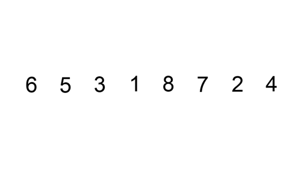

# Insertion sort

## [<<< ---](../index.md)

Insertion sort (сортировка вставками) - алгоритм, который строит отсортированную часть массива слева направо, вставляя каждый новый элемент на его место.

Ключевая идея: на каждом шаге поддерживается инвариант "левая часть уже отсортирована", а текущий элемент сдвигается в нее.

## Принцип работы

1. Считаем первый элемент отсортированным.
2. Берем следующий элемент как `key`.
3. Сдвигаем вправо все элементы больше `key`.
4. Вставляем `key` в освободившуюся позицию.
5. Повторяем до конца массива.

## Когда применять

- Маленькие массивы.
- Почти отсортированные данные (часто близко к `O(n)`).
- Как часть гибридных алгоритмов (например, `Tim sort`).

## Когда лучше выбрать другой алгоритм

- Большие массивы со случайным порядком: `./quick-sort.md`, `./merge-sort.md`, `./heap-sort.md`.
- Нужна стабильная сортировка больших массивов: `./merge-sort.md` или `./tim-sort.md`.
- Целочисленные данные с ограниченным диапазоном: `./counting-sort.md`.

## Пример на Go

https://github.com/variegate-app/docs/blob/42dd478219c2cde4138bef6c905f56010d0c5860/examples/sort/insertionsort.go#L3-L28
