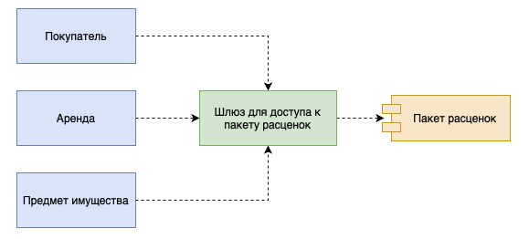

# Шлюз (Gateway)

## [<<< ---](../basic.md)

Шлюз — объект, инкапсулирующий доступ к внешней системе или источнику данных

### Назначение

Шлюз рекомендуется применять во всех случаях, когда интерфейс доступа к внешнему источнику слишком неудобен. Наличие шлюза позволяет сконцентрировать все неудобные обращения в одном месте вместо того, чтобы распространять их по всей системе. Применение шлюза не несет побочных эффектов, а код приложения становится более читабельным и понятным.

Как уже отмечалось, шлюз значительно облегчает тестирование, поскольку представляет собой потенциальную точку внедрения фиктивных служб. Даже если с интерфейсом внешней системы все в порядке, использование шлюза позволяет сделать первый шаг в направлении реализациификтивной службы.

Не менее важным преимуществом шлюза является возможность легко переключаться между источниками данных. Дня перехода к другому источнику достаточно просто изменить класс шлюза — оставшейся части системы это не коснется. Таким образом, шлюз представляет собой простое и мощное средство инкапсуляции изменений. Иногда потребность в наличии подобной степени гибкости, а следовательно, и в реализации шлюза кажется спорной. Тем не менее, даже если вы не собираетесь менять источник данных в обозримом будущем, вы несомненно выиграете от простоты написания и тестирования кода, которую обеспечивает данное типовое решение.

В качестве альтернативного варианта изолирования приложений от внешних источников может применяться паттерн [**Mapper**](mapper.md). Однако маппер имеет более сложную структуру, нежели шлюз.