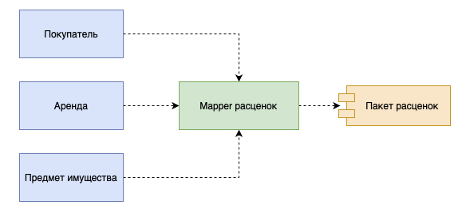

# Mapper

## [<<< ---](../basic.md)

Mapper — объект, устанавливающий взаимодействие между двумя независимыми объектами.

Основное назначение преобразователя состоит в отделении друг от друга различных частей программной системы. Похожие функции выполняет и шлюз который мы описали выше. Шлюз применяется гораздо чаще, чем маппер, поскольку он намного проще и в написании, и в последующем использовании.

Таким образом, маппер необходимо использовать только тогда, когда ни одна из отображаемых систем не должна зависеть от взаимодействия с другой системой. Это действительно важно только в том случае, когда структура взаимодействия особенно сложна и практически не связана с основным назначением каждой системы. Поэтому в корпоративных приложениях главной областью применения маппера является обслуживание взаимодействий с базой данных который выражается отдельным паттерном [**Data Mapper**](../sourcedata/datamapper.md).