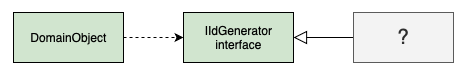

# Дополнительный модуль (Plugin)

## [<<< ---](../basic.md)

Plugin — связывает классы во время настройки, а не во время компиляции приложения.

Паттерн Separated Interface часто используется, когда один код выполняется в нескольких средах и требует разной реализации отдельной логики. Большинство разработчиков добиваются этого при помощи использования шаблона фабрики. Представим, что надо генерировать первичный ключ при помощи паттерна Separated Interface. Можно использовать для юнит-тестирования простой объект-счёчик, а на реальной системе - последовательность из БД.

Как только у вас появится ещё несколько фабрик - начнётся путаница. Создание новой конфигурации, например "запуск юнит-тестов на БД без контроля транзакций" или "запуск в продакшн на DB2 с полной поддержкой транзакций", потребует правок в условиях в большом количестве фабрик, пересборку и переразвёртывание.

Конфигурация не должна быть разбросана по приложению, также как и требовать пересборки и переразвёртывания. Паттерн Plugin решает обе эти проблемы, предоставляя централизованную динамическую конфигурацию.

### Пример реализации

Вначале нужно определить отделенный интерфейс для каждого поведения, которое требует применения различных реализаций в зависимости от выбранной исполняющей среды. Помимо этого, воспользуемся шаблоном фабрикой, несколько видоизменив его в соответствии с нашими требованиями. Реализация дополнительного модуля в виде объекта-фабрики требует, чтобы все правила связывания находились в единственной внешней точке. Это необходимо для облегчения настройки приложения. Кроме того, связывание интерфейса с реализацией должно выполняться не во время компиляции, а динамически, т.е. во время выполнения, чтобы избежать повторной сборки приложения.

Правила связывания можно хранить в обычном текстовом файле. Метод-фабрика дополнительного модуля считывает файл настроек, ищет строку, задающую реализацию запрошенного интерфейса и возвращает эту реализацию:

Применение дополнительного модуля наиболее предпочтительно в языках, поддерживающих рефлексию, поскольку объект-фабрика может создавать объекты реализаций без необходимости устанавливать зависимости во время компиляции. При использовании рефлексии файл настроек должен содержать отображения имен интерфейсов на имена классов реализаций. В этом случае объект-фабрика может находиться в пакете инфраструктуры, никак не связанном с пакетами, в которых находятся классы реализаций, и не нуждается в изменениях при добавлении в файл новых реализаций.