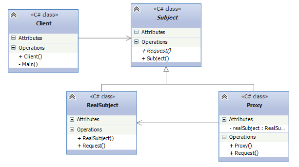

# Заместитель (Proxy)

## [<<< ---](../basic.md)

## Назначение:

Изменение требований и эволюция системы могут вызвать необходимость внесения серьезных архитектурных изменений. Если на ранних этапах некая операция выполнялась на стороне клиента или же приложение состояло из одного процесса, то со временем исполнение операции может быть перенесено на сервер, а приложение разбито на несколько процессов. В результате возникает задача взаимодействия с удаленным процессом, реализация которой должна быть максимально похожей на локальное взаимодействие. Именно для таких целей предназначен паттерн «Заместитель».

**Proxy (заместитель)**  —  ****является суррогатом другого объекта и контролирует доступ к нему.

## Когда использовать Proxy?

«Заместитель» является одним из немногих паттернов проектирования, который с течением времени претерпел довольно серьезные изменения. В классическом труде «банды четырех» описаны три основных сценария использования паттерна «Заместитель».

- **Удаленный заместитель (remote proxies)** — отвечает за кодирование запроса и его аргументов для работы с компонентом в другом адресном пространстве.
- **Виртуальный заместитель (virtual proxies)** — может кэшировать дополнительную информацию о реальном компоненте, чтобы отложить его создание.
- **Защищающий заместитель (protection proxies)** — проверяет, имеет ли вызывающий объект необходимые для выполнения запроса права.

### Участники

- **Subject**: определяет общий интерфейс для Proxy и RealSubject. Поэтому Proxy может использоваться вместо RealSubject
- **RealSubject**: представляет реальный объект, для которого создается прокси
- **Proxy**: заместитель реального объекта. Хранит ссылку на реальный объект, контролирует к нему доступ, может управлять его созданием и удалением.
- **Client**: использует объект Proxy для доступа к объекту RealSubject

### Заместитель vs. декоратор

Структуры паттернов «Заместитель» и «Декоратор» очень похожи. Каждый из них содержит ссылку на базовый компонент и делегирует ему выполнение всей работы. Но у этих паттернов разное назначение.

Декоратор добавляет поведение всем методам интерфейса, позволяя нанизывать расширения одно на другое. Класс-заместитель может выполнять определенные действия, например создавать настоящий компонент по мере необходимости, но он не должен ничего "подмешивать" в результаты исполнения операции.