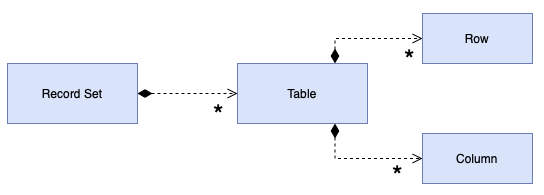

# Record Set

## [<<< ---](../basic.md)

За последние двадцать лет основным способом представления данных в БД стали реляционные таблицы. Почти каждый новый разработчик использует реляционные данные.

За это время появилось множество UI инструментов. Эти UI-фреймворки основываются на реляционности данных и предоставляют различные UI-элементы, которые легко настраиваются и управляются практически безо всякого программирования.

Обратная сторона медали в том, что, несмотря на невероятную лёгкость вывода и работы с данными, эти элементы не предусматривают возможности добавления кода бизнес-логики. Проверки типа "правильный ли формат у эта даты" и любые правила исполнения попросту некуда поставить. И в итоге, эта логика либо забивается в БД, либо смешивается в кодом вывода информации.

Суть Record Set в предоставлении структуры данных, которая выглядит в точности как результат SQL-запроса, но может управляться и обрабатываться любыми частями системы.