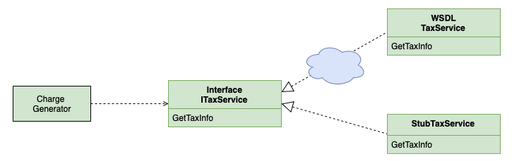

# Фиктивная служба (Service Stub)

## [<<< ---](../basic.md)

Service stub — устраняет зависимость приложения от труднодоступных или проблемных служб на время тестирования.

### Назначение

Фиктивная служба используется тогда, когда зависимость приложения от конкретной внешней службы значительно затрудняет процесс разработки и тестирования. Следует отметить, что многие приверженцы экстремального программирования употребляют термин объект-имитатор (mock object), имея в виду не что иное, как фиктивную службу. По сути каждый раз когда вам нужно имитировать работу какой-то внешней службы, можно с помощью интерфейса и DI подставить реализация stub сервиса при тестировании.