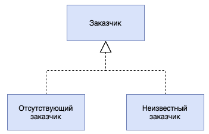

# Частный случай (Special Case)

## [<<< ---](../basic.md)

Special Case — производный класс, описывающий поведение объекта в особых ситуациях.

Значения NULL — настоящий бич объектно-ориентированных приложений. Потенциальное наличие таких значений напрочь лишает разработчика возможности воспользоваться преимуществами полиморфизма. Обычно методу можно передавать ссылки на переменные или же значения заданных типов, не беспокоясь о том, принадлежит ли переданное значение к указанному типу или же к производному классу. В строго типизированных языках проверку на правильность вызова можно проводить еще на этапе компиляции. К сожалению, если передаваемая переменная имеет значение NULL, при попытке доступа к последнему вы совершите ошибку времени выполнения и получите не более чем красивую и весьма "дружелюбную" трассировку стека.

Основная идея данного паттерна состоит в том, чтобы создать производный класс для обработки частных, особых случаев. Таким образом, чтобы избежать проверки объекта Customer на наличие значений NULL, можно создать объект NullCustomer. Последний будет переопределять все методы объекта Customer, чтобы при возникновении "особой ситуации" приложение не начало вести себя совершенно непредсказуемым образом, а выполнило что-нибудь безобидное. В этом случае при обнаружении значения NULL вызывающий метод вместо экземпляра класса Customer будет возвращать экземпляр производного класса NullCustomer. Обычно приложению не требуется проводить различие между экземплярами объекта NullCustomer, поэтому для его реализации можно воспользоваться паттерном [**Приспособленец (Flyweight)**](../struct/flyweight.md).

Как итог можно сказать следующее:

Паттерн Special Case следует применять для описания повторяющегося поведения, связанного с обработкой значений NULL ИЛИ других особых ситуаций после выполнения соответствующих проверок на их наличие.