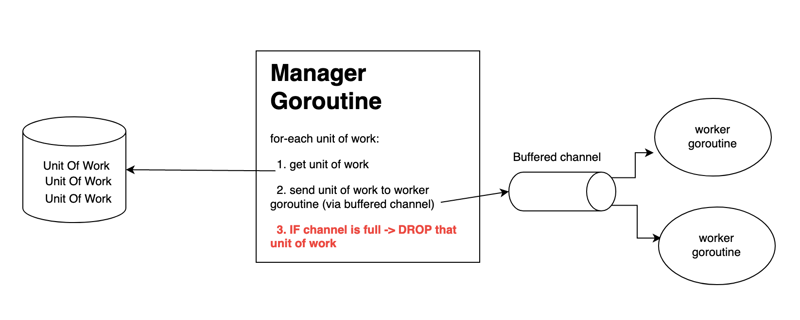

# Drop

## [<<< ---](../gochan.md)

The main idea behind **Drop Pattern** is to have a limit on the amount of work that can be done at any given moment.



We have:

- a buffered channel that provides signaling semantic
- a number of worker goroutines
- a manager goroutine that:
    - takes the work and sends it to the worker goroutine
    - if there is more work than worker goroutines can process and buffered channel is full, manager goroutine will drop the work

### Example

In **Drop Pattern** we have a limited amount of work (`capacity`) we can do in a day.

We have predefined number of `employees` that will do the work (`worker`goroutines).

We also have a `manager` (`main` goroutine) that generates work (or gets work from some predefined list of work).

`Manager` notifies employee about the work via communication channel `ch`. `Employee` gets the work from the communication channel `ch`.

Communication channel `ch` is capable of holding a limited amount of work "in the queue" (`buffered channel`). We say a channel has a limited `capacity`. Once channel `ch` is full, `manager` can't send new work and instead decides to **DROP** that unit of work and tries to send a new unit of work to the channel (maybe this time there is some space on the `ch`). `Manager` will do that as long as there is available work to do.

### Use Case

Good use case for this pattern would be a DNS server. A DNS server has a limited capacity, or limited amount of requests that it can process at any given moment. If there are more requests sent to the DNS server we can decide to overload and kill the server, or to **DROP** new requests until DNS server has capacity to process the request.

Feel free to try the example on [Go Playground](https://play.golang.com/p/vTnynyXgs_l)

```go
package main

import (
    "fmt"
    "time"
)

func main() {
    // capacity
    // max number of active requests at any given moment
    const cap = 100

    // buffered channel is used to determine when we are at capacity
    ch := make(chan string, cap)

    // a worker goroutine
    // e.g. an employee
    go func() {
        // for-range loop used to check for new work on communication channel `ch`
        for p := range ch {
            fmt.Println("employee : received signal :", p)
        }
    }()

    // amount of work to do
    const work = 200

    // range over collection of work, one value at the time
    for w := 0; w < work; w++ {
        // select-case allow us to perform multiple channel operations
        // at the same time, on the same goroutine
        select {

        // signal/send work into channel
        // start getting goroutines busy doing work
        // e.g. manager sends work to employee via buffered communication channel
        //      if buffer is full, default case is executed
        case ch <- "paper":
            fmt.Println("manager : sent signal :", w)

        // if channel buffer is full, drop the message
        // allow us to detect that we are at capacity
        // e.g. manager drops the unit of work
        default:
            fmt.Println("manager : dropper data :", w)
        }
    }

    // once last piece of work is submitted, close the channel
    // worker goroutines will process everything from the buffer
    close(ch)
    fmt.Println("manager : sent shutdown signal")

    time.Sleep(time.Second)
}

```

### Result

```
go run main.go

manager : sent signal : 0
manager : sent signal : 1
manager : sent signal : 2
manager : sent signal : 3
manager : sent signal : 4
...
manager : dropper data : 101
manager : dropper data : 102
...
employee : received signal : paper
employee : received signal : paper
...
employee 0 : received shutdown signal
...
employee : received signal : paper
employee : received signal : paper`
```