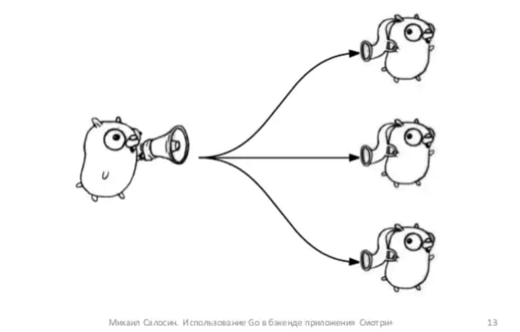
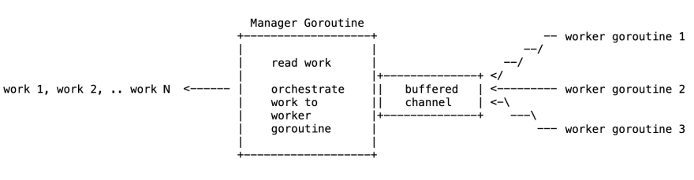

# Fan-Out

## [<<< ---](../gochan.md)

Fan-Out is a messaging pattern used for distributing work amongst workers (producer: source, consumers: destination).

We can model fan-out using the Go channels.

```go
// Split a channel into n channels that receive messages in a round-robin fashion.
func Split(ch <-chan int, n int) []<-chan int {
    cs := make([]chan int)
    for i := 0; i < n; i++ {
        cs = append(cs, make(chan int))
    }

    // Distributes the work in a round robin fashion among the stated number
    // of channels until the main channel has been closed. In that case, close
    // all channels and return.
    distributeToChannels := func(ch <-chan int, cs []chan<- int) {
        // Close every channel when the execution ends.
        defer func(cs []chan<- int) {
            for _, c := range cs {
                close(c)
            }
        }(cs)

        for {
            for _, c := range cs {
                select {
                case val, ok := <-ch:
                    if !ok {
                        return
                    }

                    c <- val
                }
            }
        }
    }

    go distributeToChannels(ch, cs)

    return cs
}
```

The `Split` function converts a single channel into a list of channels by using a goroutine to copy received values to channels in the list in a round-robin fashion.

## Fan Out Semaphore Pattern

The main idea behind **Fan Out Semaphore Pattern** is to have:

- everything we had in the **Fan Out Pattern**:
    - a buffered channel that provides a signaling semantics
    - a goroutine that starts multiple (child) goroutines to do some work
    - a multiple (child) goroutines that do some work and use signaling channel to signal the work is done
- **PLUS** the addition of a:
    - new **semaphore channel** used to restrict the number of child goroutines that can be schedule to run



### Example

In **Fan Out Pattern** we have multiple `employees` that have some work to do.

We also have a `manager` (`main` goroutine) that waits on that work to be done. Once each `employee` work is done, `employee` notifies `manager` by sending a signal (`paper`) via communication channel `ch`.

In **Fan Out Semaphore Pattern** we have an additional constraint in terms of maximum number of `employees` that can do work at any given moment.

### Explanation

For example, we have 100 employees, but only 10 available free seats in the office space. It doesn't matter that 100 employees are available to do the work when we only have adequate space for 10 employees at any given moment. Other 90 employees have to wait until on of those 10 finish the work and frees the seat.

Good use case for this pattern would be batch processing, where we have some amount of work to do, but we want to limit the number of active executors at any given moment.

```go
package main

import (
    "fmt"
    "math/rand"
    "time"
)

func main() {
    emps := 10

    // buffered channel, one slot for every goroutine
    // send side can complete without receive (non-blocking)
    ch := make(chan string, emps)

    // max number of RUNNING goroutines at any given time
    // g := runtime.NumCPU()
    g := 2
    // buffered channel, based on the max number of the goroutines in RUNNING state
    // added to CONTROL the number of goroutines in RUNNING state
    sem := make(chan bool, g)

    for e := 0; e < emps; e++ {
        // create 10 goroutines in the RUNNABLE state
        // one for each employee
        go func(emp int) {

            // when goroutine moves from RUNNABLE to RUNNING state
            // send signal/value inside a `sem` channel
            // if `sem` channel buffer is full, this will block
            // e.g. employee takes a seat
            sem <- true
            {
                // simulate the idea of unknown latency (do not use in production)
                // e.g. employee does some work
                time.Sleep(time.Duration(rand.Intn(200)) * time.Millisecond)

                // once work is done, signal on ch channel
                ch <- "paper"
                fmt.Println("employee : sent signal : ", emp)
            }

            // once all work is done pull the value from the `sem` channel
            // give place to another goroutine to do the work
            // e.g. employee stands up and free up seat for another employee
            <-sem
        }(e)
    }

    // wait for all employee work to be done
    for emps > 0 {
        // receive signal sent from the employee
        p := <-ch

        emps--
        fmt.Println(p)
        fmt.Println("manager : received signal : ", emps)

    }
}

```

### Result

```
go run main.go

employee : sent signal :  9
paper
manager : received signal :  9
employee : sent signal :  4
paper
manager : received signal :  8
employee : sent signal :  1
paper
manager : received signal :  7
employee : sent signal :  2
paper
manager : received signal :  6
employee : sent signal :  3
paper
manager : received signal :  5
employee : sent signal :  8
paper
manager : received signal :  4
employee : sent signal :  6
paper
manager : received signal :  3
employee : sent signal :  5
paper
manager : received signal :  2
employee : sent signal :  0
paper
manager : received signal :  1
employee : sent signal :  7
paper
manager : received signal :  0
```

## Fan Out Bounded Pattern

The main idea behind **Fan Out Bounded Pattern** is to have a limited number of goroutines that will do the work.

We have:

- a fixed number of worker goroutines
- a manager goroutine that creates/reads the work and sends it to the worker goroutines
- a buffered channel that provides signaling semantics
    - used to notify worker goroutines about available work



### Example

In **Fan Out Bounded Pattern** we have a **fixed** amount of `employees` that will do the work (`worker` goroutines).

We also have a `manager` (`main` goroutine) that generates work (or gets work from some predefined list of work). `Manager` notifies employee about work via communication channel `ch`. `Employee` gets the work from the communication channel `ch`.

Communication channel `ch` is capable of holding a limited amount of work "in the queue" (`buffered channel`). Once channel `ch` is full, `manager` can't send new work until `employee` takes work from the queue.

Once there is no more work for employees, `manager` closes the communication channel `ch`.

Once all the `employees` (`worker` goroutines) complete the work, they notify the manager and they all go home.

### Use Case

Good use case for this pattern would be batch processing, where we have some amount of work to do, but we have a limited number of executors. Each executor does the job of processing multiple units of work.

```go
package main

import (
    "fmt"
    "sync"
)

func main() {
    // 5 peaces of work to do
    work := []string{"paper1", "paper2", "paper3", "paper4", "paper5"}

    // number of worker goroutines that will process the work
    // e.g. fixed number of employees
    // g := runtime.NumCPU()
    g := 2

    // use waitGroup to orchestrate the work
    // e.g. each employee take one seat in the office to do the work
    //      in this case we have two seats taken
    var wg sync.WaitGroup
    wg.Add(g)

    // make buffered channel of type string which provides signaling semantics
    // e.g. manager uses this channel to notify employees about available work
        // if buffer is full, manager can't send new work
    ch := make(chan string, g)

    // create and launch worker goroutines
    for e := 0; e < g; e++ {
        go func(emp int) {
            // execute this statement (defer) when this function/goroutine terminates
            // decrement waitGroup when there is no more work to do
            // do this once for-range loop is over and channel is closed
            // e.g. employee goes home
            defer wg.Done()

            // for-range loop used to check for new work on communication channel `ch`
            for p := range ch {
                fmt.Printf("employee %d : received signal : %s\n", emp, p)
            }

            // printed when communication channel is closed
            fmt.Printf("employee %d : received shutdown signal\n", emp)
        }(e)
    }

    // range over collection of work, one value at the time
    for _, wrk := range work {
        // signal/send work into channel
        // start getting goroutines busy doing work
        // e.g. manager sends work to employee via buffered communication channel
        //      if buffer is full, this operation blocks
        ch <- wrk
    }

    // once last piece of work is submitted, close the channel
    // worker goroutines will process everything from the buffer
    close(ch)

    // guarantee point, wait for all worker goroutines to finish the work
    // e.g. manager waiits for all employees to go home before closing the office
    wg.Wait()

}

```

### Result

```
go run main.go

employee 1 : received signal : paper1
employee 1 : received signal : paper3
employee 1 : received signal : paper4
employee 1 : received signal : paper5
employee 1 : received shutdown signal
employee 0 : received signal : paper2
employee 0 : received shutdown signal
```