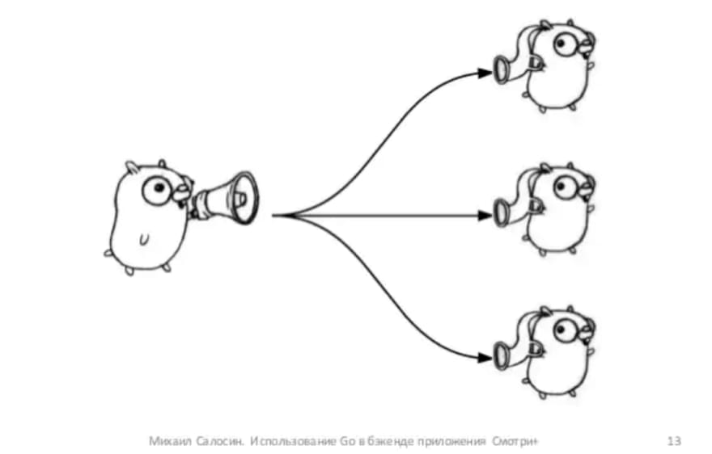
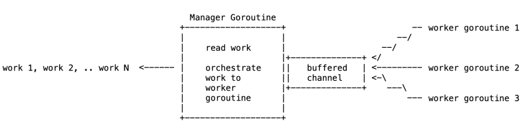

# Fan-Out

## [<<< ---](../gochan.md)

Fan-Out — это паттерн обмена сообщениями для распределения работы между несколькими исполнителями (producer: источник, consumers: получатели).

Такое поведение удобно моделировать с помощью каналов Go.

```go
// Разделяет канал на n каналов, которые получают сообщения по кругу (round-robin).
func Split(ch <-chan int, n int) []<-chan int {
    cs := make([]chan int)
    for i := 0; i < n; i++ {
        cs = append(cs, make(chan int))
    }

    // Распределяет работу по кругу между указанным числом каналов,
    // пока главный канал не будет закрыт. В этом случае все каналы
    // закрываются, и функция завершает работу.
    distributeToChannels := func(ch <-chan int, cs []chan<- int) {
        // Закрываем каждый канал по завершении обработки.
        defer func(cs []chan<- int) {
            for _, c := range cs {
                close(c)
            }
        }(cs)

        for {
            for _, c := range cs {
                select {
                case val, ok := <-ch:
                    if !ok {
                        return
                    }

                    c <- val
                }
            }
        }
    }

    go distributeToChannels(ch, cs)

    return cs
}
```

Функция `Split` превращает один канал в список каналов, используя горутину, которая копирует полученные значения в список каналов по кругу (round-robin).

## Fan Out Semaphore Pattern

Основная идея паттерна **Fan Out Semaphore**:

- всё, что есть в базовом **Fan Out**:
    - буферизованный канал, дающий семантику сигналов;
    - горутина, которая запускает несколько дочерних горутин для выполнения работы;
    - несколько дочерних горутин, которые делают работу и с помощью канала сигнализируют о завершении;
- **плюс** добавление:
    - нового **semaphore channel**, который ограничивает число дочерних горутин, которые могут выполняться одновременно.



### Пример

В базовом **Fan Out** есть несколько `employees`, у которых есть работа.

Есть `manager` (`main`‑горутина), который ждёт завершения этой работы. Как только `employee` заканчивает свою часть работы, он уведомляет `manager`, отправляя сигнал (`paper`) по каналу `ch`.

В **Fan Out Semaphore** добавляется ограничение на максимальное число `employees`, которые могут выполнять работу одновременно.

### Пояснение

Например, у нас есть 100 сотрудников, но только 10 свободных мест в офисе. Неважно, что 100 сотрудников готовы работать, если одновременно могут сидеть только 10. Оставшиеся 90 будут ждать, пока один из 10 не закончит и не освободит место.

Хороший кейс для этого паттерна — пакетная обработка, когда есть много работы, но мы хотим ограничить число активных исполнителей в каждый момент времени.

```go
package main

import (
    "fmt"
    "math/rand"
    "time"
)

func main() {
    emps := 10

    // буферизованный канал, по одному слоту на каждую горутину;
    // отправитель может завершиться, не дожидаясь приёма (не блокируется).
    ch := make(chan string, emps)

    // максимальное число ИСПОЛНЯЮЩИХСЯ горутин в любой момент времени
    // g := runtime.NumCPU()
    g := 2
    // буферизованный канал, размер которого равен максимуму RUNNING‑горутины;
    // используется для КОНТРОЛЯ числа одновременно выполняющихся горутин.
    sem := make(chan bool, g)

    for e := 0; e < emps; e++ {
        // создаём 10 горутин в состоянии RUNNABLE,
        // по одной на каждого сотрудника.
        go func(emp int) {

            // когда горутина переходит из RUNNABLE в RUNNING,
            // она отправляет значение в канал `sem`;
            // если буфер `sem` заполнен, эта операция блокируется —
            // сотрудник «занимает стул».
            sem <- true
            {
                // имитируем непредсказуемую задержку (в проде так не делаем);
                // сотрудник выполняет работу.
                time.Sleep(time.Duration(rand.Intn(200)) * time.Millisecond)

                // как только работа завершена, шлём сигнал в канал ch
                ch <- "paper"
                fmt.Println("employee : sent signal : ", emp)
            }

            // по завершении работы извлекаем значение из канала `sem`,
            // освобождая место для другой горутины —
            // сотрудник «встаёт и освобождает стул».
            <-sem
        }(e)
    }

    // ждём завершения работы всех сотрудников
    for emps > 0 {
        // получаем сигнал, отправленный сотрудником
        p := <-ch

        emps--
        fmt.Println(p)
        fmt.Println("manager : received signal : ", emps)

    }
}

```

### Result

```
go run main.go

employee : sent signal :  9
paper
manager : received signal :  9
employee : sent signal :  4
paper
manager : received signal :  8
employee : sent signal :  1
paper
manager : received signal :  7
employee : sent signal :  2
paper
manager : received signal :  6
employee : sent signal :  3
paper
manager : received signal :  5
employee : sent signal :  8
paper
manager : received signal :  4
employee : sent signal :  6
paper
manager : received signal :  3
employee : sent signal :  5
paper
manager : received signal :  2
employee : sent signal :  0
paper
manager : received signal :  1
employee : sent signal :  7
paper
manager : received signal :  0
```

## Fan Out Bounded Pattern

Основная идея паттерна **Fan Out Bounded** — фиксированное число горутин‑работников, которые выполняют весь объём задач.

У нас есть:

- фиксированное количество worker‑горутины;
- `manager`‑горутина, которая создаёт/читает задачи и отправляет их воркерам;
- буферизованный канал‑очередь, который используется для уведомления воркеров о доступной работе.



### Пример

В **Fan Out Bounded** есть **фиксированное** количество `employees`, которые выполняют работу (`worker`‑горутины).

Есть `manager` (`main`‑горутина), который генерирует задачи (или берёт их из заданного списка). `Manager` уведомляет сотрудников о работе через канал `ch`, а `employee` забирают задачи из этого канала.

Канал `ch` может хранить ограниченное количество задач в очереди (`buffered channel`). Когда `ch` заполнен, `manager` не может послать новую работу, пока кто‑то из сотрудников не заберёт задачу из очереди.

Когда задач больше нет, `manager` закрывает канал `ch`.

Когда все `employees` (`worker`‑горутины) завершают свою работу, они уведомляют менеджера и «идут домой».

### Use Case

Хороший пример для этого паттерна — пакетная обработка, где есть фиксированное число исполнителей, а каждый обрабатывает несколько единиц работы.

```go
package main

import (
    "fmt"
    "sync"
)

func main() {
    // 5 единиц работы
    work := []string{"paper1", "paper2", "paper3", "paper4", "paper5"}

    // количество worker‑горутины, которые будут обрабатывать задачи,
    // т.е. фиксированное число сотрудников
    // g := runtime.NumCPU()
    g := 2

    // используем WaitGroup для координации работы:
    // каждый сотрудник занимает одно место в офисе;
    // в этом примере занято два места.
    var wg sync.WaitGroup
    wg.Add(g)

    // создаём буферизованный канал типа string, который даёт семантику сигналов:
    // менеджер использует его, чтобы уведомлять сотрудников о наличии работы,
    // а если буфер заполнен, он временно не может отправлять новые задачи.
    ch := make(chan string, g)

    // создаём и запускаем worker‑горутины
    for e := 0; e < g; e++ {
        go func(emp int) {
            // defer выполнится при завершении горутины:
            // уменьшаем счётчик WaitGroup, когда работы больше нет
            // (фор‑рейндж закончился и канал закрыт) —
            // сотрудник «идёт домой».
            defer wg.Done()

            // цикл for‑range по каналу `ch` — сотрудник ждёт новые задачи
            for p := range ch {
                fmt.Printf("employee %d : received signal : %s\n", emp, p)
            }

            // печатается, когда канал `ch` закрыт
            fmt.Printf("employee %d : received shutdown signal\n", emp)
        }(e)
    }

    // обходим набор задач, по одной за раз
    for _, wrk := range work {
        // отправляем работу в канал, загружая goroutine:
        // менеджер посылает задачу сотрудникам через буферизованный канал;
        // если буфер заполнен, эта операция блокируется.
        ch <- wrk
    }

    // когда последняя задача отправлена, закрываем канал;
    // worker‑горутины дообработают всё, что осталось в буфере.
    close(ch)

    // точка гарантии: ждём, пока все worker‑горутины закончат работу —
    // менеджер ждёт, пока все сотрудники уйдут домой, прежде чем закрыть офис.
    wg.Wait()

}

```

### Result

```
go run main.go

employee 1 : received signal : paper1
employee 1 : received signal : paper3
employee 1 : received signal : paper4
employee 1 : received signal : paper5
employee 1 : received shutdown signal
employee 0 : received signal : paper2
employee 0 : received shutdown signal
```