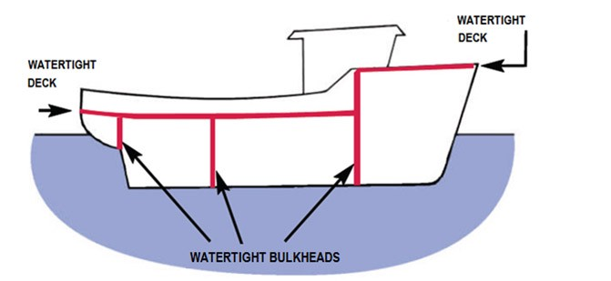

# Bulkhead
## [<<< ---](../micro.md)


Шаблон Bulkhead — это подход к дизайну приложения, который устойчив к сбоям. В bulkhead архитектуре элементы приложения изолированы в пулы, так что в случае сбоя одного, остальные продолжат функционировать. Он назван в честь секционных перегородок корпуса корабля. Если корпус корабля поврежден, только поврежденная часть наполняется водой, что предотвращает затопление корабля.

## Проблема и контекст

Облачное приложение может включать несколько сервисов, каждый из которых имеет одного или нескольких консьюмеров. Чрезмерная нагрузка или сбой в сервисе повлияют на всех консьюмеров сервисов

Более того, консьюмер может отправлять запросы к нескольким сервисам одновременно, используя ресурсы для каждого запроса. Когда потребитель отправляет запрос сервису, который неправильно настроен или не отвечает, ресурсы, используемые запросом клиента, могут быть освобождены несвоевременно. Поскольку запросы к сервису продолжаются, эти ресурсы могут быть исчерпаны. Например, пул соединений клиента может быть исчерпан. В этот момент затрагиваются запросы потребителя к другим сервисам. В конце концов потребитель больше не может отправлять запросы другим сервисам, а не только исходной не отвечающему сервису.

Та же проблема исчерпания ресурсов затрагивает сервисы с несколькими потребителями. Большое количество запросов, исходящих от одного клиента, может привести к исчерпанию доступных ресурсов сервиса. Другие потребители больше не могут использовать сервису, что приводит к эффекту каскадного сбоя (cascading failure effect).

## Решение

Разделять экземпляры сервиса на разные группы в зависимости от нагрузки потребителя и требований к доступности. Такой дизайн помогает изолировать сбои и позволяет поддерживать функциональность сервисов для некоторых потребителей даже во время сбоя.

Потребитель также может разделять ресурсы, чтобы гарантировать, что ресурсы, используемые для вызова одного сервиса, не влияет на ресурсы используемые для вызова другого сервиса. Например, потребителю, который вызывает несколько сервисов, может быть назначен пул соединений для каждого сервиса. Если сервис начинает давать сбой, это влияет только на пул соединений, назначенный для этого сервиса, что позволяет потребителю продолжать использовать другие сервисы.

### К преимуществам Bulkhead можно отнести:

- Изолирует потребителей и сервисы от каскадных сбоев. Проблема, затрагивающая потребителя или сервис, может быть изолирована внутри отдельного bulkhead`а, что предотвращает сбой всего солюшина.
- Позволяет сохранить рабочими некоторые функции в случае сбоя сервиса.
- Позволяет деплоить сервисы, предлагающие различное
- Пул консюмеров с высоким приоритетом можно настроить для использования приоритетных сервисов.

На следующей диаграмме показаны bulkheads, структурированные вокруг пулов соединений, которые вызывают отдельные сервисы. Если у `сервиса A` что-то фейлиться, пул соединений изолируется, поэтому затрагиваются только workloads, использующие пул потоков, `сервиса A`. workloads, использующие `сервисы B и C`, не затрагиваются и могут продолжать работать без задержек.


На следующей диаграмме показано, как несколько клиентов вызывают однин сервис. Каждому клиенту назначается отдельный экземпляр сервиса. Клиент 1 сделал слишком много запросов и перегрузил свой экземпляр. Поскольку каждый экземпляр сервисаизолирован от других, другие клиенты могут продолжать делать запросы.


## **Вопросы и соображения**

- Определите партишины вокруг бизнес требований и технических требований приложения.
- При разделении сервисов или потребителей на bulkhead учитывайте уровень изоляции, предлагаемый технологией, а также накладные расходы с точки зрения стоимости, производительности и управляемости.
- Рассмотрите возможность объединения bulkheads с retry, [circuit breaker](./circuitbreaker.md), и throttling patterns, чтобы обеспечить более мачурную стратегию по хэндлингу фейлов.
- При партишионинге сервисов на bulkheads рассмотрите возможность их развертывания в отдельных виртуальных машинах, контейнерах или процессах. Контейнеры предлагают хороший баланс изоляции ресурсов с довольно низкими накладными расходами.
- Сервисы коммуницирующие с помощью асинхронных сообщений, могут быть изолированы различными очередями. Каждая очередь может иметь выделенный набор экземпляров, обрабатывающих сообщения в очереди, или одну группу экземпляров, использующих алгоритм dequeue и dispatch processing.
- Определите уровень детализации для bulkhead. Например, если вы хотите распределить тенантов по partitions, вы можете поместить каждого тенанта в отдельный партишн или поместить несколько тенантовв один партишн.
- Контролируйте производительность каждого партишина и SLA.

## **Когда использовать паттерн Bulkhead**

### Используйте этот шаблон, когда:

- Изолируете ресурсы, используемые для сета backend сервисов, особенно если приложение может обеспечить некоторый уровень функционирования, даже если один из сервисов не отвечает.
- Изолируете критических консюмеров от стандартных консюмеров.
- Защищаете приложение от каскадных сбоев.

### Не используйте этот шаблон, когда:

- Менее эффективное использование ресурсов может быть неприемлемо в проекте.
- Дополнительно усложнять структуру не требуется

## Пример

Приведенный ниже k8s конфиг файл создает изолированный контейнер для запуска одного сервиса, с собственными ресурсами CPU, памяти и лимитами

```bash
apiVersion: v1
kind: Pod
metadata:
  name: drone-management
spec:
  containers:
  - name: drone-management-container
    image: drone-service
    resources:
      requests:
        memory: "64Mi"
        cpu: "250m"
      limits:
        memory: "128Mi"
        cpu: "1"
```