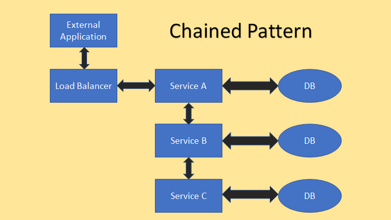

# Chain
## [<<< ---](../micro.md)

Chained шаблон имеет единую точку входа - сервис А, и другие сервисы зависят от сервиса А, и будут вызваны по цепочке.

Chain pattern не является бест решением для реализации коммуникации между микросервисами, поскольку он делает микросервисы зависимыми друг от друга.

### Недостатки шаблона **Chain**

Недостаток этого шаблона заключается в том, что он работает медленно, так как запросы проходят через несколько сервисов.

### Преимущества шаблона Chain

с другой стороны, положительная сторона этого шаблона заключается в том, что он безопасен благодаря одной точке входа. Микросервис, требующий высшей степени безопасности, можно оставить в конце цепочки, и таким образом можно ограничить к нему доступ.