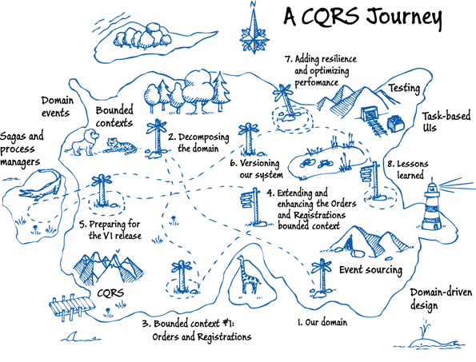

# CQRS
## [<<< ---](../micro.md)

## CQRS – Command and Query Responsibility Segregation паттерн

CQRS расшифровывается как Command Query Responsibility Segregation (разделение ответственности на команды и запросы). В 1980 Бертран Мейер сформулировал термин CQS. В начале двухтысячных Грег Янг расширил и популяризовал эту концепцию к CQRS. CQRS предлагает разделять операции чтения и записи на отдельные типы операций Query и Commands.

- Command ориентированы на задачи, а не на данные. ("Забронировать номер в отеле", а не установить для ReservationStatus значение "зарезервировано" ).
- Command может помещаться в очередь для асинхронной обработки, а не обрабатываться синхронно.
- Query никогда не должен изменять базу данных. Query возвращает DTO, который не инкапсулирует знания предметной области.

Наличие отдельных моделей запросов и команд упрощает проектирование таких систем как независимых друг от друга. Однако один из недостатков заключается в том, что код CQRS не может автоматически формироваться из схемы базы данных с помощью ORM или подобных механизмов. Для дополнительной изоляции часто физически разделяют данные для чтения и данные для записи. Как это описано на диаграмме выше. В этом случае в БД для чтения можно оптимизировать ее работу так, чтобы максимально эффективно выполнять запросы. К примеру заюзать *materialized view*, чтобы не использовать сложные операции join'ов или сложные связи. Вы можете использовать в том числе другой тип хранилища данных. Например, база данных для записи останется реляционной, а для чтения вы можете применять NoSQL или наоборот, в зависимости от бизнес задач.

Если вы пошли по пути отдельных БД для чтения и записи, они должны поддерживать синхронизацию. Обычно это реализуют с помощью событий при каждом обновлении базы данных. Обновление базы данных и публикации события должны выполняться в рамках одной транзакции.

### 👍 Преимущества CQRS

- **Независимое масштабирование**. CQRS позволяет раздельно масштабировать рабочие нагрузки чтения и записи, снижая риск конфликтов блокировки.
- **Оптимизированные схемы данных**. Для query применить схему, оптимизированную для запросов, а commands — другую схему, оптимизированную для обновлений.
- **Безопасность**. Разделение операций позволит настроить более гибкую систему доступа.
- **Разделение проблем**. Разделение операций позволяет получить более гибкие и простые в обслуживании классы.
- **Более простые запросы**. Сохраняя в базе данных для чтения materialized view, вы предотвратите использование сложных запросов и join'ов.
- **Не требует 2 хранилища данных**. Отдельные хранилища для query и command это одна из реализаций, а не обязательное требование

### 👎 Недостатки CQRS

- **Сложность.** Основная идея CQRS звучит просто. Но ее реализация может привести к усложнению проекта приложения, особенно если реализовывать его в связке с Event Sourcing.
- **Обмен сообщениями**. Сама по себе модель CQRS не требует месседжинга, но месседж брокеры часто применяются для обработки команд и публикации событий. Это означает, нужно будет реализовывать обработку сбоев и дубликатов при передаче сообщений.
- **Eventual consistency**. Если вы разделите базы данных для чтения и записи, в базе данных для чтения могут оставаться устаревшие данные. БД для чтения должна быть up to date, чтобы отражать изменения из БД для записи, и может быть трудно трекать, когда пользователь сделал запрос на основе устаревших данных с БД для чтения.