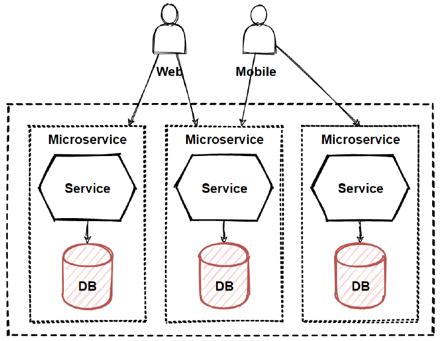

# Database per Microservice
## [<<< ---](../micro.md)

Разные сервисы предъявляют разные требования к хранению данных. Для некоторых сервисов реляционная база данных является лучшим выбором. Другим сервисам может потребоваться база данных NoSQL, такая как MongoDB, которая хороша для хранения сложных неструктурированных данных, или Neo4J, которая предназначена для эффективного хранения и запроса данных в формате графа.

Одной из основных характеристик архитектуры микросервисов является слабая связанность сервисов . По этой причине каждый сервис должен иметь свои собственные базы данных.

Основная идея **database per service pattern** - микросервисы не имет доступа к базе соседних сервисов и обращаются между собой средством REST, или через меседж брокер. Таким образом наши микросервисы становятся действительно независимыми от стореджа и могут разрабатываться параллельно.

## Преимущества и недостатками Database per service

### Преимущества:

- Слабая связанность сервисов. Изминения в бд одного сервиса не влияют на другие сервисы как при [**Shared database**](shareddatabase.md) .
- Каждый сервис может использовать тот тип БД который подходит лучше для его нужд. Например один сервис может использовать Elastic поиск, второй NoSQL, третий SQL, если этого требует бизнес логика и NFR.

### Недостатки:

- Реализация бизнес-транзакций, охватывающих несколько сервисов, довольно комплексное задание. Распределенных транзакций лучше избегать из-за CAP теоремы. Более того, многие современные (NoSQL) базы данных их не поддерживают.
- Реализация запросов, которые джоинит данные с разных баз данных, не тривиальная задача.
- Сложность управления несколькими базами данных SQL и NoSQL.

Существуют различные шаблоны/решения для реализации транзакций и запросов для микросервисной архитектуры:

- [**Saga и распределенные транзакции**](saga.md)
- [**CQRS**](cqrs.md)
- [**Шлюз (Gateway)**](../basic/gateway.md)
- [**Aggregator**](aggregator.md)
- [**Chain**](chain.md)
- [**Branch**](branch.md)
- [**Ambassador**](ambassador.md)

Отмечу, что выбрав Database per service,  паттерны которые я привел выше - придется чаще имплементировать в ваши приложения, тк без их помощи адекватные кросс-сервисные транзакции будет сделать очень сложно.