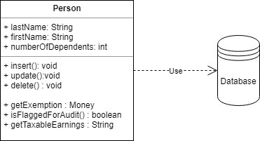

# Active Record (Активная запись)

## [<<< ---](../sourcedata.md)

Один объект управляет и данными, и поведением. Большинство этих данных постоянны и их надо хранить в БД. Этот паттерн использует подход - хранение логики доступа к данным в объекте сущности.

Объект является "обёрткой" одной строки из БД или представления, включает в себя доступ к БД и логику обращения с данными.

Пример: объект "Person" содержит данные об одной персоне и методы: добавить, обновить или удалить. По сути паттерн продвигает идею когда модель и логика сосредоточены в 1 классе.

рассмотрим диаграмму класса "Person":