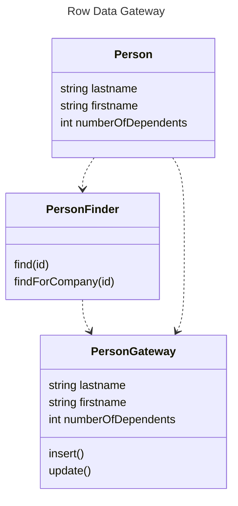

# Row Data Gateway (Шлюз к данным записи)

## [<<< ---](../sourcedata.md)

Встраивание кода доступа к БД в объекты, хранящиеся в памяти, может привести в некоторым неудобствам. Во-первых, если ваши объекты содержат бизнес-логику, добавление взаимодействия с БД увеличит сложность. Вскоре тестирование станет неудобным, если объекты, хранящиеся в памяти, завязаны на БД. Тесты станут медленнее из-за доступа к БД. 

Объект шлюза к записи представляется в точности, как запись в БД, но при этом даёт возможность доступа посредством штатных средств языка программирования. Все подробности доступа к БД скрыты за этим интерфейсом.

Пример: объект шлюза PersonGateway, данные о записи из таблицы person и методы insert и update, которые позволяют прозрачно работать с записью. 

Качественная реализация этого паттерна на PHP существует в частности в Zend Framework в классе Zend_Db_Table_Row.