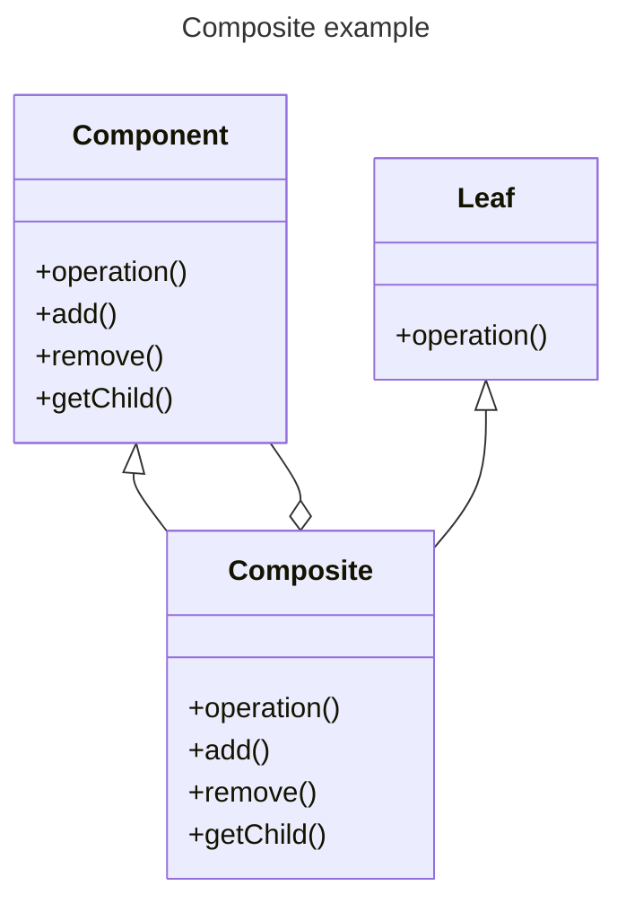

# Composite

## [<<< ---](../struct.md)

## Назначение:

Компонует объекты в древовидные структуры для представления иерархий «часть — целое». Позволяет клиентам единообразно трактовать индивидуальные и составные объекты.

Реализацию паттерна можно представить в виде меню, которое имеет различные пункты. Эти пункты могут содержать подменю, в которых, в свою очередь, также имеются пункты. То есть пункт меню служит с одной стороны частью меню, а с другой стороны еще одним меню. В итоге мы однообразно можем работать как с пунктом меню, так и со всем меню в целом.

## Когда использовать Composite?

- Когда объекты должны быть реализованы в виде иерархической древовидной структуры
- Когда клиенты единообразно должны управлять как целыми объектами, так и их составными частями. То есть целое и его части должны реализовать один и тот же интерфейс

## Применимость

Компоновщик — это относительно низкоуровневый паттерн проектирования, который лежит в основе других паттернов. Команды объединяются в составные команды, декоратор является составным объектом с одним дочерним элементом, посетитель очень часто обходит составные объекты иерархической формы.