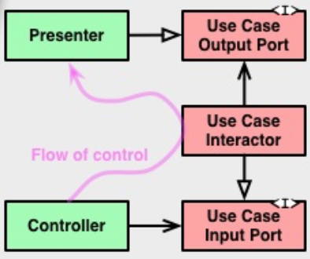
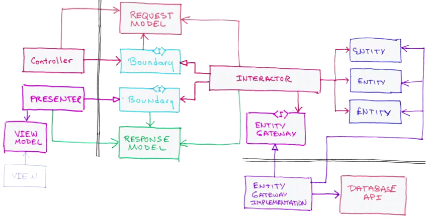

# чистая архитектура
## [<<< ---](../README.md)

## Основные принципы чистой архитектуры

1. Независимость от фреймворков и библиотек.
2. Разделение на слои.
3. Использование интерфейсов.
4. Принцип единственной ответственности (Single Responsibility Principle).
5. Принцип инверсии зависимостей (Dependency Inversion Principle).

Принцип инверсии зависимостей решает вопрос о том, как пакеты должны ссылаться друг на друга. Лучший способ достичь этого редко бывает очевиден, особенно в Go, где циклы импорта запрещены. Возможно, именно поэтому некоторые разработчики утверждают, что лучше избегать «вложенности» и держать весь код в одном пакете. Но пакеты существуют по определенной причине, и причина эта — принцип разделения ответственности.

Слои сервиса

[Доменная область](clean_arch/domain.md)

[Приложение](clean_arch/application.md)

[Адаптеры / Инфраструктура](clean_arch/adapter.md)

[
**External Layer / Внешние источники данных** ](clean_arch/external.md)

**Переходы между слоями осуществляются через Boundaries**, то есть через два интерфейса: один для запроса и один для ответа. Их можно увидеть справа на оригинальной схеме (Input/OutputPort). Они нужны, чтобы внутренний слой не зависел от внешнего (следуя Dependency Rule), но при этом мог передать ему данные.

Оба интерфейса относятся к внутреннему слою (обратите внимание на их цвет на картинке).
Controller вызывает метод у InputPort, его реализует UseCase, а затем UseCase отдает ответ интерфейсу OutputPort, который реализует Presenter. То есть данные пересекли границу между слоями, но при этом все зависимости указывают внутрь на слой UseCase’ов.
*Чтобы зависимость была направлена в сторону обратную потоку данных, применяется [принцип инверсии зависимостей](https://ru.wikipedia.org/wiki/%D0%9F%D1%80%D0%B8%D0%BD%D1%86%D0%B8%D0%BF_%D0%B8%D0%BD%D0%B2%D0%B5%D1%80%D1%81%D0%B8%D0%B8_%D0%B7%D0%B0%D0%B2%D0%B8%D1%81%D0%B8%D0%BC%D0%BE%D1%81%D1%82%D0%B5%D0%B9)* (буква D из аббревиатуры [SOLID](https://ru.wikipedia.org/wiki/SOLID_(%D0%BE%D0%B1%D1%8A%D0%B5%D0%BA%D1%82%D0%BD%D0%BE-%D0%BE%D1%80%D0%B8%D0%B5%D0%BD%D1%82%D0%B8%D1%80%D0%BE%D0%B2%D0%B0%D0%BD%D0%BD%D0%BE%D0%B5_%D0%BF%D1%80%D0%BE%D0%B3%D1%80%D0%B0%D0%BC%D0%BC%D0%B8%D1%80%D0%BE%D0%B2%D0%B0%D0%BD%D0%B8%D0%B5))). То есть, вместо того чтобы UseCase напрямую зависел от Presenter’a (что нарушало бы Dependency Rule), он зависит от интерфейса в своём слое, а Presenter должен этот интерфейс реализовать.
Точно та же схема работает и в других местах, например, при обращении UseCase к Gateway/Repository. Чтобы не зависеть от репозитория, выделяется интерфейс и кладется в слой UseCases.
Что же касается данных, которые пересекают границы, то это должны быть **простые структуры**. Они могут передаваться как [DTO](https://ru.wikipedia.org/wiki/DTO) или быть завернуты в HashMap, или просто быть аргументами при вызове метода. Но они обязательно должны быть *в форме более удобной для внутреннего слоя* (лежать во внутреннем слое).

- Entities – функции или объекты с методами, которые реализуют логику бизнеса, общую для многих приложений (а если бизнеса нет, то самую высокоуровневую логику приложения);
- DTO, необходимые для работы и перехода между слоями.
- **Interactor – объект, который реализует use case ([сценарий использования](https://ru.wikipedia.org/wiki/%D0%A1%D1%86%D0%B5%D0%BD%D0%B0%D1%80%D0%B8%D0%B9_%D0%B8%D1%81%D0%BF%D0%BE%D0%BB%D1%8C%D0%B7%D0%BE%D0%B2%D0%B0%D0%BD%D0%B8%D1%8F)), используя бизнес-объекты (Entities)**.
- *UseCase – это детализация, описание действия, которое может совершить пользователь системы*.

В слое UseCases находятся не только Interactor’ы, но также и Boundaries для работы с презентером, интерфейс для работы с репозиторием, DTO для запроса и ответа. 

Реализация Gаteway получает данные из БД, и использует их, чтобы создать структуры данных, которые будут переданы в Entities, которые Gateway вернет. Реализовано это может быть композицией или наследованием

Маппинг происходит в слое Interface Adapters, то есть в Presenter и Repository

- [Заблуждения Clean Architecture](https://habr.com/ru/companies/mobileup/articles/335382/)
- [Clean Architecture in Go [2024 Updated]](https://pkritiotis.io/clean-architecture-in-golang/)
- [Clean Architecture in GO [May 24, 2023]](https://rudrakshnanavaty.hashnode.dev/clean-architecture-in-go)