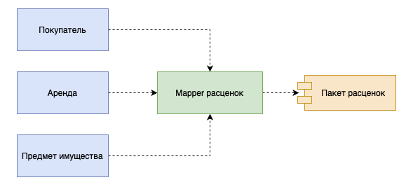

# Mapper

Mapper — объект, устанавливающий взаимодействие между двумя независимыми объектами.

Основное назначение преобразователя состоит в отделении друг от друга различных частей программной системы. Похожие функции выполняет и шлюз который мы описали выше. Шлюз применяется гораздо чаще, чем маппер, поскольку он намного проще и в написании, и в последующем использовании.

Таким образом, маппер необходимо использовать только тогда, когда ни одна из отображаемых систем не должна зависеть от взаимодействия с другой системой. Это действительно важно только в том случае, когда структура взаимодействия особенно сложна и практически не связана с основным назначением каждой системы. Поэтому в корпоративных приложениях главной областью применения маппера является обслуживание взаимодействий с базой данных который выражается отдельным паттерном [**Data Mapper**](../%D0%9F%D0%B0%D1%82%D1%82%D0%B5%D1%80%D0%BD%D1%8B%20%D0%B0%D1%80%D1%85%D0%B8%D1%82%D0%B5%D0%BA%D1%82%D1%83%D1%80%D1%8B%20%D0%B8%D1%81%D1%82%D0%BE%D1%87%D0%BD%D0%B8%D0%BA%D0%BE%D0%B2%20%D0%B4%D0%B0%D0%BD%D0%BD%D1%8B%D1%85%20645d9518f0fc4a299c5585f614906cba/Data%20Mapper%20f6505bd8adc84ec78b116c5f0ca9cc81.md).