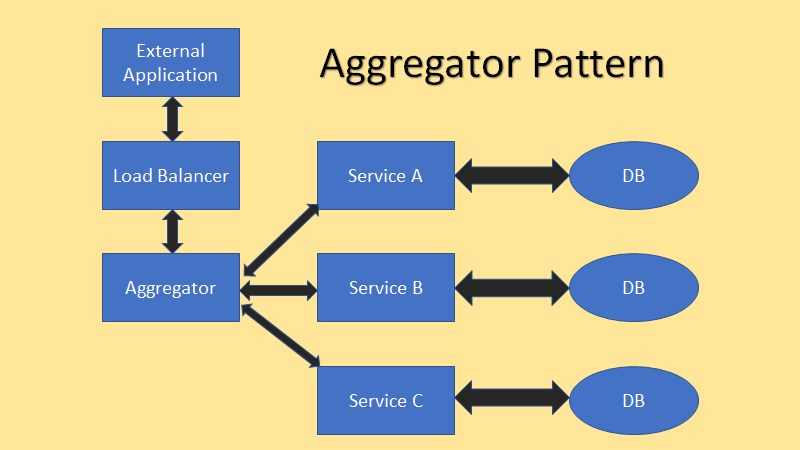

# Aggregator
## [<<< ---](../micro.md)

На диаграмме выше показано как он работает. Существует один агрегатор, который собирает весь запрос из внешнего источника, передает его соответствующему микросервису и возвращает результат. Aggregator node здесь может выполнять любые необходимые манипуляции с данными, такие как добавление timestamp в заголовок запроса или добавление имени запрашивающего для целей регистрации и тд.