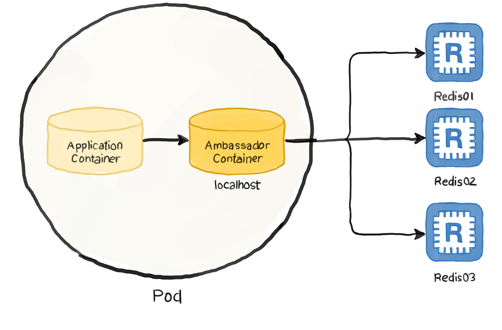

# Ambassador
## [<<< ---](../micro.md)

Паттерн Ambassador позволяет перенести client connectivity tasks такие как: мониторинг, логинг маршрутизация, обеспечение безопасности (например, поддержка TLS) и другие на proxy сервис. Этот подход в частных случаях немного похож на [**Заместитель (Proxy)**](../%D0%91%D0%B0%D0%B7%D0%BE%D0%B2%D1%8B%D0%B5%20%D0%BF%D0%B0%D1%82%D1%82%D0%B5%D1%80%D0%BD%D1%8B%201a0aa0bab3524861858579af05c60be4/%D0%97%D0%B0%D0%BC%D0%B5%D1%81%D1%82%D0%B8%D1%82%D0%B5%D0%BB%D1%8C%20(Proxy)%20acf1a695433947058f94f804dd9434f0.md) .

## Проблема и контекст

Для разработки устойчивых приложений в облаке важны такие функции, как [**Circuit Breaker**](circuitbreaker.md) , роутинг, сбор метрик, мониторинг и обновление сетевых конфигураций. Бывает трудно или даже невозможно обновлять легаси приложения или библиотеки , чтобы добавить в них эти функции (например, если код уже не поддерживается или у команды разработчиков нет необходимых знаний).

Сетевые вызовы иногда также требуют существенные усилия по настройке подключения, аутентификации и авторизации. Если эти вызовы используются в нескольких приложениях, созданных на разных языках и платформах, настройку вызовов придется выполнять отдельно для каждого экземпляра. Кроме того, часто есть смысл передать управление сетями и безопасностью в пределах всей организации централизованной группе девелоперов. Если кодбейз огромен и эти девы вносят изменения в незнакомые участки кода, повышается риск возникновения ошибок.

## Решение

Вынесите клиентские фреймворки и библиотеки во внешний процесс, который будет выполнять роль Ambassador'a между приложением и внешними сервисами. Разверните этот сервер в той же среде, что и основное приложение, чтобы получить полный контроль над функциями маршрутизации, устойчивости и безопасности, а также избежать любых проблем с ограничениями доступа. Шаблон амбассадора поможет стандартизировать и расширить инструментирование. Прокси-сервер может отслеживать метрики производительности, например задержку и использование ресурсов, непосредственно в той среде, где размещено приложение.

Переданные амбассадору функции доступны для управления независимо от приложения. Посредник можно легко заапдейтить по возможности, не вмешиваясь в работу существующих компонентов приложения. Кроме того, вы сможете создать отдельные команды специалистов для внедрения и обслуживания безопасности, сети и аутентификации, функции которых будет покрывать амбассадор.

Сервис амбассадора можно развернуть так же в качестве [**Sidecar**](sidecar.md) . И наоборот, если посредник требуется сразу для нескольких отдельных сервисов в одном хосте, его можно развернуть как службу Windows, или как часть пода в k8s в случае если используется контейнеризация.

## Проблемы и вопросы при реализации

- Использование прокси сопровождается дополнительной задержкой. Возможно, рациональнее будет использовать клиентскую библиотеку, которую приложение вызывает напрямую.
- Определите, как обобщение компонентов, перемещаемых в посредник, может повлиять на работу. Например, если в амбассадоре реализован механизм ретраев, это может быть небезопасно для операций, не являющихся идемпотентными.
- Постарайтесь создать механизм, который позволит передать контекст от клиента к прокси и (или) от прокси к клиенту. Например, добавьте специальный заголовок HTTP-запроса, позволяющий запретить ретраи или ограничить их количество.
- Продумайте, как лучше деплоить прокси.
- Выберите количество экземпляров: один общий для всех клиентов или по одному для каждого клиента.

### Используйте этот шаблон, когда:

- если нужно создать общий набор клиентских функций между сервисами которые написаны на разных языках или платформах;
- если нужно заофлоадить cross-cutting функции специалистам по инфраструктуре или по конкретным узким отраслям;
- если требуется поддержка облачного или кластерного коннекшина для приложения, которое устарело или по другим причинам не поддается доработке.

### Не используйте этот шаблон, когда:

- Если критически важнен пинг в сети для запросов. Использование посредника сопровождается дополнительной, хоть и небольшой, задержкой, и в некоторых случаях это может повлиять на приложение.
- Если все клиентские функции подключения реализованы на одном языке. В таком случае целесообразнее создать клиентскую библиотеку, предоставляя ее командам разработчиков в виде пакета.
- Если функции подключения невозможно обобщить или требуется более глубокая интеграция с клиентским приложением.