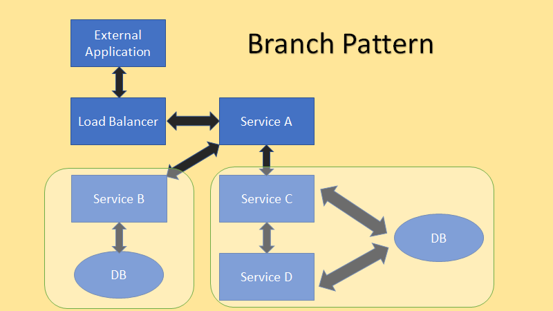

# Branch
## [<<< ---](../micro.md)

Branch pattern - это гибрид паттерна агрегатор и паттерна chain. В приведенном выше примере мы видим что сервис А служит **агрегатором**, и бранчуется на две ветки. Одна ветка содержит один автономный сервис B, а вторая ветвь содержит **цепочку** из сервисов (Сервис C  и D). Этот  паттерн будет полезен, когда большое монолитное приложение нужно раздробить на приложение с микросервисной архитектурой.