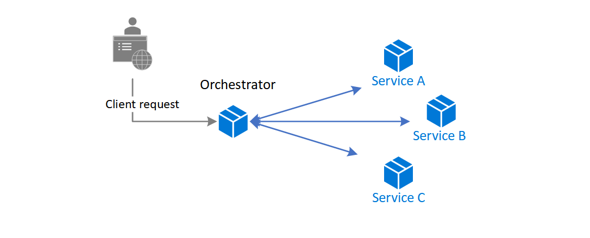

# Choreography
## [<<< ---](../micro.md)
Суть шаблона Choreography - каждый компонент системы участвует в принятии решений о ходе бизнес-транзакции, не полагаясь на центральную точку управления.

## Контекст и проблема

В микросервисной архитектуре бывает так. что cloud-base приложение делиться на несколько  небольших сервисов работающих вместе для комплексной обработки бизнес-транзакции. Для снижения "coupling" между сервисами, каждый сервис отвечает за единую бизнес-операцию. Некоторые преимущества включают более быструю разработку, меньший code base и масштабируемость.

Шаблон Orchestrator сокращает point-2-point коммуникацию между сервисами, но имеет ряд недостатков из-за тесной связи между Orchestratorом и другими сервисами, участвующими в обработке бизнес-транзакции. Для выполнения задач в очереди, оркестратору нужно иметь некоторые доменные знания про эти сервисы. Если вы хотите добавить или удалить сервисы, существующая логика будет нарушена, и необходимо будет заново "вклинивать" в процесс новые сервисы.

## Решение

Позвольте каждому сервису, самостоятельно определять, когда и как обрабатывать бизнес-операцию, не создавая зависимостей от центрального оркестратора.

Один из вариантов реализации хореографии есть месседж брокер, для координации запросов.

Клиентский запрос публикует сообщения в очередь. Каждый сервис, на которую оформлена подписка, выполняет свою часть операции, как указано в сообщении, и реагирует на очередь сообщений с успешным или неудачным выполнением операции. В случае успеха сервис может отправить сообщение обратно в ту же очередь или в другую очередь сообщений, чтобы при необходимости другой сервис  мог продолжить выполнение рабочего процесса. В случае сбоя операции шина сообщений может повторить эту операцию.

Таким образом, сервисы "хореографируют" workflow между собой без необходимости в зависимости от оркестратора или прямой связи между ними.

Так как нет связи «point-to-point», этот шаблон помогает сократить coupling между сервисами. Кроме того, он может устранить узкие места в производительности, вызванные оркестрацией, при работе с транзакциями.

## Когда следует использовать шаблон хореографии

- Используйте шаблон хореографии, если планируется частое обновление, удаление или добавление новых сервисов.
- Используйте этот паттерн когда у вас возникают узкие места производительности при работе с оркестратором.
- Этот шаблон является "натуральным" для serverless архитектуры, в которой все сервисы могут быть short lived или event based.

## Проблемы и вопросы при реализации

Децентрализация Orchestratorа может вызвать проблемы при управлении workflow.

Если сервису не удается выполнить бизнес-операцию, восстановление после сбоя может быть затруднено. Один из способов заключается в том, чтобы сервис обрабатывал ошибку, и пушил ивент. Другой сервис подписывается на эти события, и выполняет необходимые действия, такие как применение [компенсирующих транзакций](https://bool.dev/blog/detail/saga-pattern-i-raspredelennye-tranzaktsii) для отмены успешных операций в цепочке. Сервис который зафейлился также может не пушить ивент. В этом случае рассмотрите возможность использования механизма retry policy.

Реализация паттерна хореографии становится сложной задачей, если количество сервисов быстро растет. Учитывая большое количество независимых развивающихся сервисов, Рабочий процесс между сервисами, как правило, усложняется. Кроме того, Распределенная трассировка усложняется.