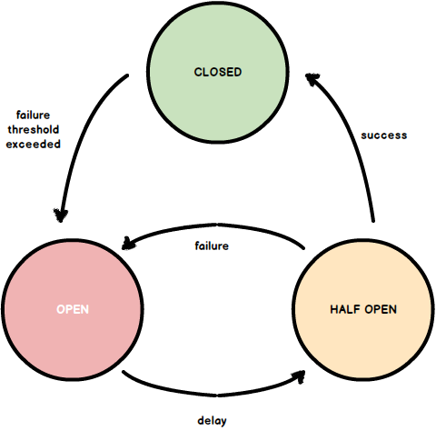

# Circuit Breaker
## [<<< ---](../micro.md)


## Проблема и контекст

В отличии от Retry паттерна, паттерн Circuit Breaker рассчитан на менее ожидаемые ошибки, которые могут длиться намного дольше: обрыв сети, отказ сервиса, оборудования. В этих ситуациях при повторной попытке отправить аналогичный запрос с большой долей вероятности мы получим аналогичную ошибку. Например, приложение взаимодействует с неким сервисом, и в рамках реализации запросов и ответов предусмотрен некоторый тайм-аут, по истечении которого, если от сервиса не получен ответ, то операция считается не успешной. В случае проблем с этим сервисом, во время ожидания ответа и до достижения тайм-аута приложение может потреблять какие-то критически важные ресурсы (память, процессорное время), которые скорее всего нужны другим частям приложения. В такой ситуации, для приложения будет предпочтительнее завершить операцию с ошибкой сразу, не дожидаясь тайм-аута от сервиса и повторять попытку только тогда, когда вероятность успешного завершения будет достаточно высока.

## Решение

Паттерн **Circuit Breaker** предотвращает попытки приложения выполнить операцию, которая скорее всего завершится неудачно, что позволяет продолжить работу дальше не тратя важные ресурсы, пока известно, что проблема не устранена. Приложение должно быстро принять сбой операции и обработать его.

Он также позволяет приложению определять, была ли устранена неисправность. Если проблема устранена, приложение может попытаться вызвать операцию снова.

у  **Circuit Breaker** есть 3 состояния:


1) **Closed**: Запрос приложения перенаправляется на операцию. Прокси-сервер ведет подсчет числа недавних сбоев, и если вызов операции не завершился успешно, прокси-сервер увеличивает это число. Если число недавних сбоев превышает заданный порог в течение заданного периода времени, прокси-сервер переводится в состояние **Открытый**. На этом этапе прокси-сервер запускает таймер времени ожидания, и по истечении времени этого таймера прокси-сервер переводится в состояние **Half-Open**. Цель применения этого паттерна — дать системе время на исправление ошибки, которая вызвала сбой, прежде чем разрешить приложению попытаться выполнить операцию еще раз.

Назначение таймера — дать сервису время для решения проблемы, прежде чем разрешить приложению попытаться выполнить операцию еще раз.

2) **Open**: запрос от приложения немедленно завершает с ошибкой и исключение возвращается в приложение.

3) **Half-Open:** Ограниченному числу запросов от приложения разрешено проходить через операцию и вызывать ее. Если эти запросы выполняются успешно, предполагается, что ошибка, которая ранее вызывала сбой, устранена, а автоматический выключатель переходит в состояние **Закрытый** (счетчик сбоев сбрасывается). Если какой-либо запрос завершается со сбоем, автоматическое выключение предполагает, что неисправность все еще присутствует, поэтому он возвращается в состояние **Открытый** и перезапускает таймер времени ожидания, чтобы дать системе дополнительное время на восстановление после сбоя.

Состояние **Half-Open** помогает предотвратить быстрый рост запросов к сервису. Т.к. после начала работы сервиса, некоторое время он может быть способен обрабатывать ограниченное число запросов до полного восстановления.

Шаблон **Circuit Breaker** обеспечивает стабильность, пока система восстанавливается после сбоя и снижает влияние на производительность.

## Кейсы:

### Exception Handling

Приложение, вызывающее операцию через Circuit Breaker, должно быть подготовлено к обработке исключений, возникающих, если операция недоступна. Способ обработки исключения будет зависеть от приложения. Например, приложение может временно понизить функциональность, вызвать альтернативную операцию для выполнения той же задачи или получения тех же данных или сообщить об исключении пользователю и попросить его повторить попытку позже.

### Types of Exceptions

Ваш реквест может завершиться с ошибкой по многим причинам. Некоторые из них могут указывать на более серьезные ошибки, чем другие. Например, запрос может завершиться со сбоем, так как произошло аварийное завершение удаленного сервиса и требуется несколько минут для восстановления, или из-за истечения времени ожидания в связи с временной перегрузкой сервиса. Сircuit breaker может исследовать типы возникающих исключений и корректировать свою стратегию в зависимости от характера этих исключений. Например, может потребоваться большее количество исключений времени ожидания для перевода автоматического выключения в состояние **Open** по сравнению с количеством ошибок из-за того, что сервис полностью недоступна.

### Logging

При использовании Сircuit breakera мы должны логировать все эрроры (вполне возможно и успешные реквесты), чтобы позволить DevOps'у правильно настроить мониторинг и "переключатель" между состояниями.

### Recoverability

Автоматическое выключение нужно настроить в соответствии с вероятным шаблоном восстановления защищаемой операции. Например, если автоматическое выключение остается в состоянии **open** в течение длительного периода времени, оно может создавать исключения, даже если сбой был устранен. Аналогично автоматическое выключение может меняться и уменьшать время отклика приложений, если оно переключится из состояния **open** в состояние **Half-Open** слишком быстро.

### Тестирование failed операций

В состоянии **open** вместо использования таймера для определения момента перехода в состояние **Half-Open** автоматическое выключение может периодически проверять удаленный сервис или ресурс, чтобы определить, когда они снова станут доступны. Проверка связи может принимать форму попытки вызвать операцию, которая ранее завершилась со сбоем, или она может использовать специальную операцию, предоставляемую удаленного сервиса специально для проверки работоспособности сервиса.

### Manual Override

В системе, где время восстановление failed операции может меняться, можно предоставить вариант ручного сброса, который позволяет админу поменять состояние внутри Сircuit breakera. Аналогично администратор может принудительно отключить автоматическое выключение в состоянии **Open** (и перезапустить таймер времени ожидания), если операция, защищенная автоматическим выключением, временно недоступна.

### Параллелизм

К одному Сircuit breaker'y может обращаться множество параллельных экземпляров приложения. Реализация не должна блокировать параллельные запросы или добавлять слишком большие нагрузки для каждого вызова операции.

### Различия между ресурсами

Обращайте внимание при использовании одного Сircuit breaker для одного типа ресурсов, если может быть несколько базовых независимых поставщиков. Например, в хранилище данных, которое содержит несколько сегментов, один сегмент может быть полностью доступен, в то время как другой может испытывать временные проблемы. Если сообщения об ошибках в этих сценариях объединены, приложение может попытаться получить доступ к некоторым сегментам даже при высокой вероятности сбоя, в то время как другие сегменты могут быть заблокированы, несмотря на то что они могут быть успешно выполнены.

Accelerated Circuit Breaking

Иногда сообщение об ошибке может содержать достаточно информации для активации и работы Сircuit breakerа в течение минимального количества времени. Например, сообщение об ошибке перегруженного общего ресурса (HTTP 429)  может указывать на то, что выполнение немедленной повторной попытки не рекомендуется и приложению следует повторить попытку через несколько минут.

### Воспроизведение неудачных запросов

В состоянии **Открытый**, вместо того, чтобы просто быстро выполнить завершение со сбоем, Сircuit breaker может также записывать сведения о каждом запросе в лог и подготавливать эти запросы для воспроизведения, когда удаленный ресурс или служба станут снова доступны.

### Неподходящее время ожидания внешних служб

Сircuit breaker шаблон может оказаться не в состоянии полностью защитить приложения от операций, завершающихся со сбоем во внешних сервисах, настроенных с длительным периодом ожидания. Если время ожидания слишком велико, поток, выполняющий Сircuit breaker, может быть заблокирован в течение длительного периода времени, прежде чем Сircuit breaker покажет, что операция не выполнена. В это время множество других экземпляров приложений могут также попытаться вызвать сервис через Сircuit breaker и связать значительное количество потоков, прежде чем все они завершатся со сбоем.

## Когда использовать Сircuit breaker шаблон?

### Используйте этот шаблон, когда:

- Чтобы предотвратить попытки вызова приложением удаленного сервиса или получения доступа к общему ресурсу, если эта операция, скорее всего, завершится ошибкой.

### Не используйте этот шаблон, когда:

- Для обработки доступа к локальным закрытым ресурсам в приложении, например, в структуре данных в памяти. В этой среде при использовании Сircuit breaker нагрузка в системе возрастет.
- В качестве замены для обработки исключений в бизнес-логике приложений.


## Golang

Similar to electrical fuses that prevent fires when a circuit that is connected to the electrical grid starts drawing a high amount of power which causes the wires to heat up and combust, the circuit breaker design pattern is a fail-first mechanism that shuts down the circuit, request/response relationship or a service in the case of software development, to prevent bigger failures.

**Note:** The words "circuit" and "service" are used synonymously throught this document.

## **Implementation**

Below is the implementation of a very simple circuit breaker to illustrate the purpose of the circuit breaker design pattern.

### **Operation Counter**

`circuit.Counter` is a simple counter that records success and failure states of a circuit along with a timestamp and calculates the consecutive number of failures.

```go
package circuit

import (
    "time"
)

type State int

const (
    UnknownState State = iota
    FailureState
    SuccessState
)

type Counter interface {
    Count(State)
    ConsecutiveFailures() uint32
    LastActivity() time.Time
    Reset()
}
```

### **Circuit Breaker**

Circuit is wrapped using the `circuit.Breaker` closure that keeps an internal operation counter. It returns a fast error if the circuit has failed consecutively more than the specified threshold. After a while it retries the request and records it.

**Note:** Context type is used here to carry deadlines, cancelation signals, and other request-scoped values across API boundaries and between processes.

```go
package circuit

import (
    "context"
    "time"
)

type Circuit func(context.Context) error

func Breaker(c Circuit, failureThreshold uint32) Circuit {
    cnt := NewCounter()

    return func(ctx context) error {
        if cnt.ConsecutiveFailures() >= failureThreshold {
            canRetry := func(cnt Counter) {
                backoffLevel := Cnt.ConsecutiveFailures() - failureThreshold

                // Calculates when should the circuit breaker resume propagating requests
                // to the service
                shouldRetryAt := cnt.LastActivity().Add(time.Seconds * 2 << backoffLevel)

                return time.Now().After(shouldRetryAt)
            }

            if !canRetry(cnt) {
                // Fails fast instead of propagating requests to the circuit since
                // not enough time has passed since the last failure to retry
                return ErrServiceUnavailable
            }
        }

        // Unless the failure threshold is exceeded the wrapped service mimics the
        // old behavior and the difference in behavior is seen after consecutive failures
        if err := c(ctx); err != nil {
            cnt.Count(FailureState)
            return err
        }

        cnt.Count(SuccessState)
        return nil
    }
}
```