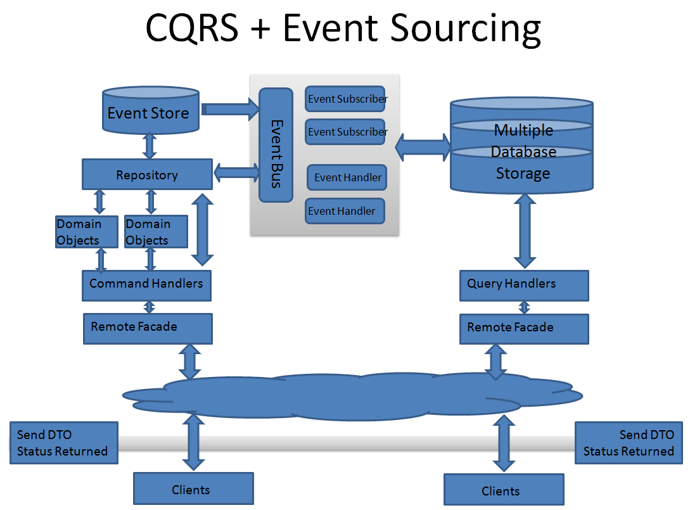
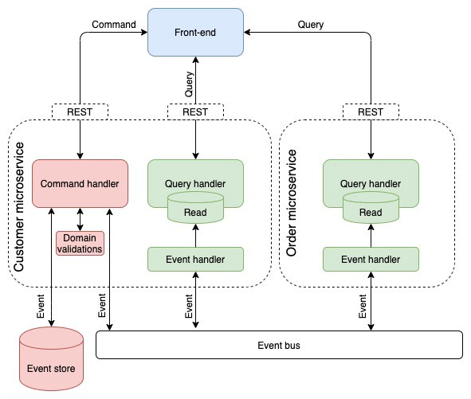

# Event Sourcing
## [<<< ---](../micro.md)
**Event sourcing** (источники событий, регистрация событий, генерация событий) — это архитектурный паттерн, в котором все изменения, вносимые в состояние приложения, сохраняются в той последовательности, в которой они были выполнены. Эти записи служат как источником для получения текущего состояния, так и audit-log'ом того, что происходило в системе. Event sourcing способствует децентрализованному изменению и чтению данных. Такая архитектура хорошо масштабируется и подходит для систем, которые уже работают с событиями или подходят для миграции на такую архитектуру.

Event sourcing идет в ногу с CQRS. "DELUXE" cхема связки CQRS + Event Sourcing выглядит следующим образом:

У Event sourcing есть следующие преимущества и недостатки:

### 👍 Преимущества Event Sourcing

- События immutable, и их можно сохранить с помощью append-only операции.
- События могут раниться на фоне.
- Event sourcing может помочь в предотвращении конфликтов, вызванных параллельными апдейтами, тк исключает необходимость непосредственного обновления объектов в Data store. Однако доменная модель должна уметь себя защищать от запросов, которые могут вызвать несогласованное состояние.
- Append-only storage предоставляет audit log, который можно использовать для мониторинга событий, произошедших в Data store, повторного создания текущего состояния в виде materialized view или проекций путем воспроизведения событий в любое время, а также упрощения тестирования и отладки системы.
- Каждое событие могут обрабатывать несколько задач. Это обеспечивает простую интеграцию с другими службами и системами, которые только слушают новые события, вызванные data stor'ом. Однако event sourcing events зачастую являются низкоуровневыми, из-за чего может потребоваться создание определенных событий интеграции.

### 👎 Недостатки CQRS

- Самые большие сложности обычно связаны с перестроением мышления разработчиков. Разработчики должны забыть про обычные CRUD-приложения и хранилища сущностей. Теперь основной концепцией становятся события.
- При Event Sourcing много сил тратится на моделирование событий. После сохранения событий в сторедж они должны быть immutable, иначе история и состояние могут быть повреждены или искажены. Event Log — это исходные данные, а это значит, что необходимо очень внимательно следить за тем, чтобы они содержали всю информацию, необходимую для получения полного состояния системы на определенный момент времени. Также необходимо учитывать, что события могут интерпретироваться повторно, поскольку система (и бизнес, который она представляет) со временем изменяются.
- Для простой бизнес логики переход на Event Sourcing может быть довольно легким, но для более сложных может стать проблемой (особенно с большим количеством зависимостей и отношений между сущностями). Так же могут возникнуть сложности интеграции с внешними системами, которые не предоставляют данные на определенный момент времени.
- Event Sourcing может работать хорошо в больших системах, так как паттерн «Event Log» естественным образом масштабируется горизонтально. Например, event log одной сущности необязательно должен физически находиться вместе с журналом событий другой сущности. Однако, такая легкость масштабирования приводит к дополнительным проблемам в виде решения проблем и реализацией eventual consistency.
- Важно учитывать структуру событий. Структура событий может измениться в какой-то момент, например набор полей. Могут возникнуть ситуации, когда исторические события должны быть обработаны текущей бизнес-логикой. И наличие расширяемой схемы событий поможет в будущем при необходимости отличать новые события от старых. Периодические снапшоты также помогают отделить серьезные изменения структуры событий.

### Имплементация

Я не стану приводить примеры кода, их множество в интернете, мне кажется важнее показать схемы что б у вас как читателей этой статьи был helicopter-view и как строить такие системы в будущем.

Давайте начнем с такой диаграммы:

Это не то, как вы используете Event Sourcing.

Однако важная часть состоит в том, что события предметной области живут внутри контекста, потому что они являются неотъемлемой частью модели предметной области. Следовательно, события предметной области редко открываются внешнему миру как есть, поскольку они связывают модель предметной области с контрактом службы, поскольку они *становятся* контрактом. Это последнее, что мы хотим сделать. Разделение событий, отправляемых во внешний мир, публикация этих событий в виде контракта на обслуживание и поддержание их стабильности - это правильное решение.

Еще одна проблема заключается в том, что возможности Event Sourcing в устранении двухфазных коммитов здесь теряются. На диаграмме видно, что сохранение события и его публикация в шине - это две разные операции. Мы *всегда* сохраняем события в хранилище и используем хранилище как источник событий. Это возможно с продуктами, которые поддерживают потоки событий в реальном времени, например [EventStoreDB](https://www.eventstore.com/). Это также лишает нас необходимости в каком-либо event bus внутри службы для построения модели чтения, которая отображена зеленым на диаграмме. Также важно, что чаще всего проекция на стороне чтения должна обрабатывать события по порядку, и ни один продукт, называемый *шиной, не* может этого сделать.

Вот исправленная, упрощенная схема того, как это должно быть:

Источники событий заботятся о логике записи, где события сохраняются в хранилище событий и транслируются с использованием подхода публикации/подписки, чтобы информировать микросервисы об изменении данных.

### Когда следует использовать Event Sourcing

- Когда в данные необходимо записать намерение, цель или причину. Например, изменения в сущности клиента можно записать как ряд определенных типов событий, таких как *Возвращение к исходному*, *Закрытая учетная запись* или *Недействительные*.
- Когда очень важно свести к минимуму или полностью избежать конфликта операций обновления данных.
- Если требуется записывать происходящие события и иметь возможность воспроизвести их для восстановления определенного состояния системы, отката изменений или сохранения истории и audit-log. Например, если задача включает несколько шагов, необходимых для восстановления обновлений и последующего воспроизведения некоторых действий для восстановления согласованного состояния данных.
- Когда использование событий представляет собой стандартную возможность операции приложения и требует некоторой дополнительной разработки или усилий в отношении реализации.
- Если нужно разбить процесс ввода или обновления данных из задач, необходимых для применения этих действий. Это может быть в целях улучшения производительности пользовательского интерфейса или распределения событий в другие прослушиватели, выполняющие определенные действия при возникновении событий. Например, интеграция платежной системы с веб-сайтом о расходах требуется для того, чтобы события, вызванные с помощью хранилища событий в ответ на обновления данных, реализованные для веб-сайта, использовались как веб-сайтом, так и платежной системой.
- Если необходима гибкость для изменения формата материализованных моделей и данных сущности при изменении требований или —использовании в сочетании с CQRS, необходимо адаптировать модель чтения или представления с данными.
- Если используется в сочетании с CQRS, eventual consistency допустима при обновлении модели чтения или допустимо влияние на производительность при восстановленных сущностях и данных из потока события.

### Когда не следуюет использовать Event Sourcing

- Для небольших или простых доменов, систем, которые обычно хорошо взаимодействуют со стандартными механизмами управления данных CRUD.
- Систем, где для представления данных требуются согласованность и обновления в режиме реального времени.
- Систем, где для действий отката и воспроизведения не требуются определенные функции, история и audit-log.
- Систем, где имеется незначительный конфликт обновлений в базовых данных. Например, это системы, которые преимущественно добавляют данные, а не обновляют их.

## Выводы

CQRS и Event Sourcing — это интересный подход, имеющий свои преимущества. Одно из которых — упрощение расширения системы в будущем. Поскольку event log хранит все события, то их можно использовать во внешних системах. Довольно легко интегрироваться через добавление новых обработчиков событий.

Помните, что прежде чем интегрировать у себя CQRS и Event Sourcing нужно определить действительно ли вам это нужно, принцип KISS еще никто не отменял.

Однако, ограничения, связанные со сложностью предметной области, требованиями к согласованности и доступности данных, а также увеличение объема хранимых данных и масштабируемость в долгосрочной перспективе — все это необходимо учитывать при выборе этих паттернов. Так же важно уделять внимание разработчикам, которые будут разрабатывать и поддерживать такую систему на протяжении всего SDLC.