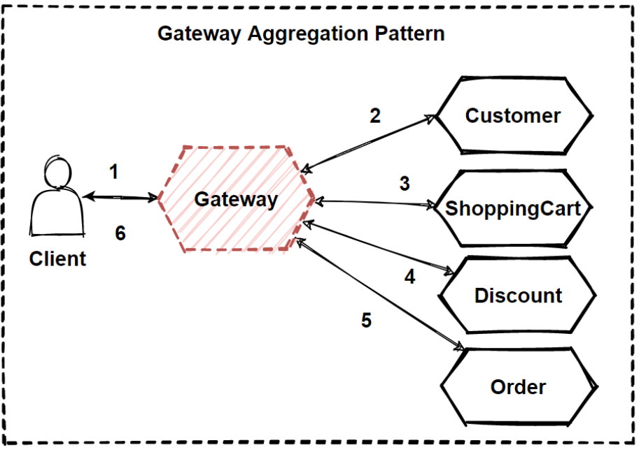

# Gateway Aggregation
## [<<< ---](../micro.md)


Этот шаблон полезен, когда клиент должен сделать несколько обращений к разным внутренним системам для выполнения операции.

## Контекст и проблема

Для выполнения одной задачи клиенту может потребоваться сделать несколько вызовов различных backend сервисов. Приложение, которое использует множество сервисов для выполнения задачи, должно расходовать ресурсы на каждый запрос. Когда в приложение добавляется новая фича или сервис, требуются дополнительные запросы, что еще больше увеличивает требования к ресурсам и cross-service вызовам.

На диаграмме ниже клиент отправляет запросы каждому сервису (1,2,3). Каждый сервис обрабатывает запрос и отправляет ответ обратно в приложение (4,5,6). В сотовой сети с обычно высоким пингом использование отдельных запросов таким образом неэффективно и может привести к нарушению соединения или обрывам запросов. Хотя каждый запрос может выполняться параллельно, приложение должно отправлять, ждать и обрабатывать данные для каждого запроса, все через отдельные соединения, что увеличивает вероятность сбоя.


## Решение

Используйте Gateway, чтобы уменьшить количество запросов между клиентом и сервером.

Этот шаблон может уменьшить количество запросов, которые приложение отправляет к back-end сервисам, и повысить производительность приложения в high-latency сетях.

На следующей диаграмме приложение отправляет запрос шлюзу (1). Запрос содержит пакет дополнительных запросов. Шлюз декомпозирует их и обрабатывает каждый запрос, отправляя его соответствующему сервису(2). Каждый сервис возвращает ответ в gateway(3). Gateway объединяет ответы от каждого сервиса и отпавляет ответ приложению (4). Приложение делает один запрос и получает только один ответ от шлюза.

## Проблемы и вопросы при реализации

- Gateway не должен создавать coupling между back-end сервисами.
- Gateway должен располагаться рядом с back-end сервисами, чтобы максимально уменьшить задержку.
- Сервис шлюза может создать Single point of failure. Убедитесь, что gateway спроектирован правильно и соответствует требованиям доступности вашего приложения.
- Gateway может стать узким местом. Убедитесь, что gateway имеет достаточную производительность для обработки нагрузки и может быть масштабирован в соответствии с ожидаемым ростом.
- Выполните нагрузочное тестирование шлюза, чтобы исключить каскадные сбои сервисов.
- Реализуйте resilient design, используя такие методы, как: [**Bulkhead**](bulkhead.md) , [**Circuit Breaker**](circuitbreaker.md) , retry, и timeouts .
- Если один или несколько сервисных вызовов занимают слишком много времени, может быть допустимо установить тайм-аут и вернуть частичный набор данных. Подумайте, как ваше приложение будет обрабатывать этот сценарий.
- Используйте асинхронный I/O, чтобы гарантировать, что задержка на сервере не вызовет проблем с производительностью в приложении.
- Реализуйте распределенную трассировку, используя correlation ID для отслеживания каждого отдельного реквеста.
- Отслеживайте показатели запросов и размеры ответов.
- Рассмотрите возможность возврата кэшированных данных в качестве стратегии отработки отказа для обработки сбоев.
- Вместо того чтобы встраивать агрегацию в gateway, рассмотрите возможность размещения [](https://bool.dev/blog/detail/aggregator-chain-i-branch-patterny-dlya-mikroservisov)[**Aggregator**](aggregator.md) за шлюзом. Агрегация запросов, вероятно, будет иметь другие требования к ресурсам, чем другие сервисы в шлюзе, и может повлиять на функции маршрутизации и разгрузки шлюза.

### Используйте этот шаблон, когда:

- Клиент должен взаимодействовать с несколькими внутренними сервисами для выполнения операции.
- Клиент может использовать сети со значительной задержкой, такие как сотовые сети.

### Не используйте этот шаблон, когда:

- Вы хотите сократить количество вызовов между клиентом и одним сервисом в рамках нескольких операций. В этом случае лучше добавить в сервис batch операцию.
- Клиент или приложение расположены рядом с backend сервисом, и задержка не является существенным фактором.

## Пример агрегации шлюзов NGINX с помощью Lua

В следующем примере показано, как создать простой сервис агрегации шлюзов NGINX с помощью Lua.

```bash
worker_processes  4;

events {
  worker_connections 1024;
}

http {
  server {
    listen 80;

    location = /batch {
      content_by_lua '
        ngx.req.read_body()

        -- read json body content
        local cjson = require "cjson"
        local batch = cjson.decode(ngx.req.get_body_data())["batch"]

        -- create capture_multi table
        local requests = {}
        for i, item in ipairs(batch)dotable.insert(requests, {item.relative_url, { method = ngx.HTTP_GET}})
end

        --execute batch requestsin parallel
local results = {}
local resps = { ngx.location.capture_multi(requests) }
for i, resin ipairs(resps)dotable.insert(results, {status = res.status, body = cjson.decode(res.body), header = res.header})
end

        ngx.say(cjson.encode({results = results}))
      ';
    }

    location = /service1 {
      default_type application/json;
      echo '{"attr1":"val1"}';
    }

    location = /service2 {
      default_type application/json;
      echo '{"attr2":"val2"}';
    }
  }
}
```