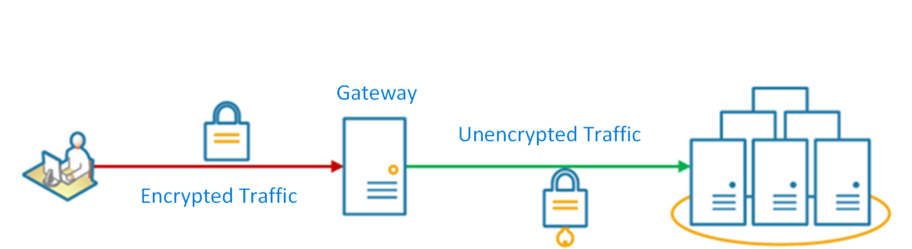

# Gateway Offloading паттерн
## [<<< ---](../micro.md)
Этот шаблон может упростить разработку приложений за счет переноса общего функционала сервисов, таких как использование сертификатов SSL, из других частей приложения в шлюз.

Этот паттерн чем-то похож на [**Ambassador**](ambassador.md) , но в данном случае "амбассадором" выступает Gateway.

## Контекст и проблема

Некоторые функции обычно используются в нескольких сервисах, и эти функции требуют настройки, управления и обслуживания. Общий или специализированный сервис , выпущенный при каждом деплои приложения, увеличивает административные издержки и повышает вероятность ошибки деплоя. Любые обновления общей функции должны быть задеплоены во всех сервисах, использующих эту функцию.

Надлежащее решение вопросов безопасности (проверка токена, шифрование, управление SSL-сертификатами) и других сложных задач может потребовать от членов команды узкоспециализированных навыков. Например, сертификат, необходимый приложению, должен быть настроен и развернут во всех экземплярах приложения. При каждом новом развертывании необходимо управлять сертификатом, чтобы гарантировать, что срок его действия не истечет. Любой общий сертификат, срок действия которого истекает, необходимо обновлять, тестировать и проверять при каждом развертывании приложения. Таким образом SSL детерминейшн еще и замедляет общение между клиентом и back-end сервисами.

## Решение

Перенесите некоторые функции в gateway, в частности cross-cutting задачи, такие как управление сертификатами, аутентификация, детерминация SSL, мониторинг, преобразование протоколов или регулирование.

На следующей диаграмме показан шлюз, который терминирует входящие соединения SSL. Он запрашивает данные от имени original requestorа с любого HTTP-сервера upstreamа от шлюза.



### К преимуществам Gateway Offloading паттерна относятся:

- Упрощение разработки сервисов, избавившись от необходимости поддерживать вспомогательные ресурсы, такие как сертификаты веб-серверов и настройки для безопасных веб-сайтов. Более простая конфигурация упрощает управление и масштабируемость, а также упрощает обновление сервисов.
- Позволяет выделенным командам реализовывать функции, требующие специальных знаний, таких как безопасность. Это позволяет вашей основной команде сосредоточиться на функциональности приложения, оставив эти специализированные, но сквозные вопросы соответствующим экспертам.
- Обеспечивает некоторую консистенси для request и response logging. Даже если служба неправильно оснащена, шлюз можно настроить так, чтобы обеспечить минимальный уровень мониторинга и логирования

## Проблемы и вопросы при реализации

- Убедитесь, что gateway постоянно доступен и устойчив к сбоям. Избегайте single points of failure, запускайте несколько экземпляров шлюза.
- Убедитесь, что gateway соответствует требованиям capacity и масштабирования вашего приложения и endpointы. Убедитесь, что шлюз не становится узким местом для приложения и достаточно масштабируем.
- "Офлоадите" только те функции, которые используются всем приложением, такие как безопасность или передача данных.
- Бизнес-логика никогда не должна быть "заофложена" на gateway.
- Если вам нужно отслеживать транзакции, рассмотрите возможность создания correlation ID для целей логирования.

## Когда использовать Gateway Offloading шаблон?

### Используйте этот шаблон, когда:

- Деплой приложения имеет общую проблему, такую как сертификаты SSL или шифрование.
- Функция, которая является общей для деплоя приложений, которые могут иметь разные требования к ресурсам, таким как ресурсы памяти, емкость хранилища или сетевые подключения.
- Вы хотите передать ответственность за такие фичи, как: сетевая безопасность, throttling или другие проблемы, связанные с network boundary, более специализированной команде.

### Не используйте этот шаблон, когда:

- Этот шаблон может быть неприемлемым, если он добавляет coupling между сервисами

## **Пример**

Используя Nginx в качестве SSL offloadа, следующая конфигурация терминирует входящее соединение SSL и распределяет соединение на один из трех upstream HTTP-серверов.

```bash
upstream iis {
        server  10.3.0.10    max_fails=3    fail_timeout=15s;
        server  10.3.0.20    max_fails=3    fail_timeout=15s;
        server  10.3.0.30    max_fails=3    fail_timeout=15s;
}

server {
        listen 443;
        ssl on;
        ssl_certificate /etc/nginx/ssl/domain.cer;
        ssl_certificate_key /etc/nginx/ssl/domain.key;

        location / {
set$targ iis;
                proxy_pass http://$targ;
                proxy_set_header X-Forwarded-For$proxy_add_x_forwarded_for;
                proxy_set_header X-Forwarded-Proto https;
proxy_set_header X-Real-IP$remote_addr;
                proxy_set_header Host$host;
        }
}
```