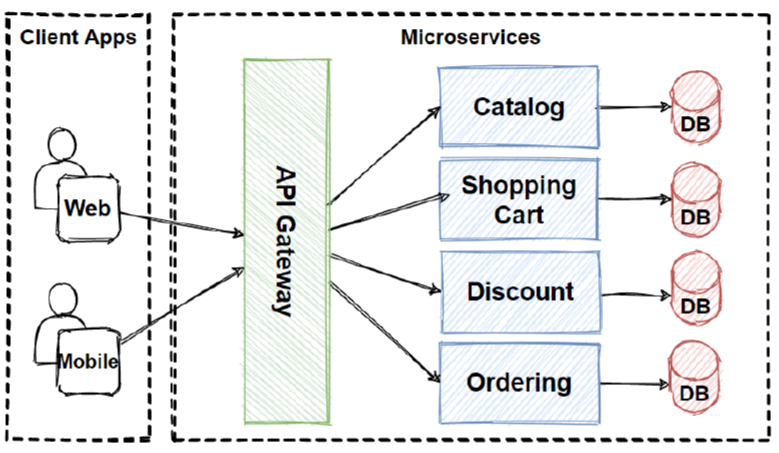

# Gateway Routing
## [<<< ---](../micro.md)


Gateway Routing pattern  — это роутинг запросов к нескольким микросервисам с предоставлением одного эндпоинта который "торчит" наружу . Этот шаблон полезен, когда мы хотим предоставить несколько сервисов на одном эндпоинте и роутить их во внутренние back-end сервисы на основе запроса.

## Контекст и проблема

Когда клиенту необходимо использовать несколько сервисов, настройка отдельного эндпоинта для каждого сервиса и предоставление клиенту возможности управлять каждым эндпоинтом может оказаться сложной задачей. Например, e-commerce приложение может предоставлять такие услуги, как поиск, обзоры заказов, корзина, оформление заказа и история заказов. Каждый сервис имеет свой API, с которым должен взаимодействовать клиент, и клиент должен знать о каждом эндпоинте, чтобы подключиться к сервисам. При изменении API клиент также должен быть обновлен.

## Решение

Поместите gateway перед сетом приложений, сервисов или деплойментов. Используйте gateway на load balancing уровня 7 (приложения), чтобы направить запрос в соответствующие инстансы.

При использовании этого шаблона клиентскому приложению нужно знать только об одном эндпоинте и взаимодействовать с ним. Если вы меняете сервис или декомпозируете его, клиент необязательно требует обновления. Он может продолжать делать запросы к шлюзу, и изменится только маршрутизация.

Шлюз также позволяет абстрагировать backend сервисы от клиентов, что позволяет упростить клиентские вызовы и в то же время позволяет вносить изменения в backend сервисы за шлюзом. Клиентские вызовы можно перенаправлять на любой сервис или сервисы, необходимые для обработки ожидаемого поведения клиента, что позволяет добавлять, разделять и реорганизовывать сервисы за шлюзом без изменения клиента.


Gateway Routing паттерн также может помочь при деплое, позволяя вам управлять как именно апдейты аплаяться для пользователей. При деплое новой версии сервиса его можно деплоить параллельно с существующей версией. Роутинг внутри шлюза позволит вам контролировать, какая версия сервиса будет доступна клиентам, предоставляя вам гибкость в использовании различных стратегий деплоя, будь то инкрементное, параллельное или complete rollouts апдейт. Любые проблемы, обнаруженные после деплоя нового сервиса, можно быстро исправить, изменив конфигурацию на шлюзе, не затрагивая ваших клиентов.

## Проблемы и вопросы при реализации

- Gateway service может быть single point of failure. Убедитесь, что он правильно спроектирован и соответствует вашим требованиям к доступности. При внедрении учитывайте resiliency и fault tolerance capabilities.
- Gateway service может стать узким местом. Убедитесь, что шлюз имеет достаточную производительность для обработки нагрузки и может легко масштабироваться в соответствии с вашими ожиданиями роста.
- Выполните нагрузочное тестирование шлюза, чтобы исключить каскадные сбои служб.
- Маршрутизация через шлюз — это уровень 7 OSI. Она может основываться на IP-адресе, порте, заголовке или URL-адресе.

## Когда использовать Gateway Routing шаблон?

### Используйте этот шаблон, когда:

- Клиенту необходимо использовать несколько сервисов, к которым можно получить доступ через шлюз.
- Вы хотите упростить клиентские приложения, используя один endpoint.
- Вам необходимо направлять запросы от внешних эндпоинтов к внутренним виртуальным эндпоинтам, например предоставлять порты на виртуальной машине для кластерных виртуальных IP-адресов.

### Не используйте этот шаблон, когда:

- Этот шаблон может не подойти, если у вас есть простое приложение, использующее только один или два сервиса.

## Пример

Используя Nginx в качестве router'a, ниже приведен пример файла конфигурации для сервера, который направляет запросы для приложений, находящихся в разных виртуальных каталогах, на разные машины на бэкенде.

```bash
server {
    listen 80;
    server_name domain.com;

    location /app1 {
        proxy_pass http://10.0.3.10:80;
    }

    location /app2 {
        proxy_pass http://10.0.3.20:80;
    }

    location /app3 {
        proxy_pass http://10.0.3.30:80;
    }
}
```