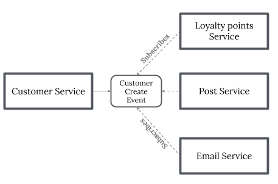

# Saga и распределенные транзакции
## [<<< ---](../micro.md)
помогают отменить операцию которая выполняется в несколько шагов, которые вместе можно назвать как консистентная операция (транзакция).

## Проблема и контекст

Приложения, работающие в облаке, часто изменяют данные. Эти данные могут быть распределены по источникам данных, хранящихся в различных географических точках. Во избежание конфликтов и повышения производительности в распределенной системе, приложение не должно пытаться обеспечить высокую согласованность транзакций. Скорее, приложение должно реализовывать **"возможную согласованность" (eventual consistency)**. В этой модели типичная бизнес-операция состоит из серии автономных шагов. В то время как эти шаги выполняются, общее представление о состоянии системы может быть непоследовательным, но когда операция завершена и все шаги выполнены, система должна снова стать согласованной.

Серьезной проблемой в модели **возможной согласованности (eventual consistency)** является то, как обработать шаг, который не удалось обработать. В этом случае может потребоваться отменить всю работу, выполненную предыдущими шагами операции. Однако данные нельзя просто откатить, потому что другие параллельные экземпляры приложения, возможно, уже изменили эти данные. Даже в тех случаях, когда данные не были изменены параллельным экземпляром, отмена шага может быть не просто вопросом восстановления исходного состояния. Может возникнуть необходимость применить различные правила, специфичные для бизнеса.

Транзакция - это логически атомарная единица работы, которая может охватывать несколько запросов к базе данных. Все транзакции должны следовать ACID требованиям:

### Atomicity — Атомарность

Атомарность гарантирует, что никакая транзакция не будет зафиксирована в системе частично. Будут либо выполнены все её подоперации, либо не выполнено ни одной.

### Consistency — Согласованность

Транзакция, достигающая своего нормального завершения (EOT — end of transaction, завершение транзакции) и, тем самым, фиксирующая свои результаты, сохраняет согласованность базы данных. Другими словами, каждая успешная транзакция по определению фиксирует только допустимые результаты. Это условие является необходимым для поддержки четвёртого свойства.

### Isolation — Изолированность

Во время выполнения транзакции параллельные транзакции не должны оказывать влияния на её результат (Уровни изоляции транзакций)

### Durability — Стойкость

Стойкость — если пользователь получил подтверждение от системы, что транзакция выполнена, он может быть уверен, что сделанные им изменения не будут отменены из-за какого-либо сбоя.

## Решение

Решением проблемы описанной выше может стать **Compensating Transaction Pattern**. Таким шаблоном может выступить **Saga pattern**.

Когда каждый сервис имеет свою собственную базу данных и бизнес-транзакция охватывает несколько сервисов, как мы обеспечиваем согласованность данных между сервисами. Каждый запрос имеет компенсационный запрос, который выполняется при сбое запроса. Это может быть реализовано двумя способами:

- **Choreography (Хореография)** — при отсутствии центра координации, каждый сервис создает и слушает события другого сервиса и решает, следует ли предпринять действие или нет. Хореография это способ указать, как две или более сторон; ни один из которых не имеет никакого контроля над процессами других сторон, или, возможно, какой-либо видимости этих процессов - не может координировать свои действия и процессы для обмена информацией и ценностями. Используйте хореографию, когда требуется координация между областями контроля / видимости. Вы можете думать о хореографии в простом сценарии как о сетевом протоколе. Это диктует приемлемые образцы запросов и ответов между сторонами.
    
    
    
- [**Orchestration (Оркестрация)**](https://bool.dev/blog/detail/pattern-choreography) — оркестратор (объект) берет на себя ответственность за принятие сагой решений и последовательность бизнес-логики. когда у вас есть контроль над всеми участниками процесса. когда все они находятся в одной области контроля, и вы можете контролировать поток действий. Это, конечно, чаще всего, когда вы указываете бизнес-процесс, который будет выполняться внутри одной организации, которую вы контролируете.
    
    
    

**Sagas** исходят из осознания того, что особо долгоживущие транзакции, а также далеко распределенные транзакции по границам местоположения и / или доверия не могут быть легко обработаны с использованием классической модели ACID c **Two-Phase Commit**принципом.

### Two-Phase Commit

- Фаза подготовки: На этом этапе управляющий узел запрашивает все участвующие узлы, готовы ли они принять транзакцию. Участвующие узлы тогда ответили бы да или нет.
- Фаза фиксации. Затем, если все узлы ответили утвердительно, управляющий узел попросит их зафиксировать, в противном случае, даже если один узел ответил отрицательно, он попросит откатить назад.

Вместо этого Saga разбивает работу на отдельные транзакции, последствия которых могут быть каким-то образом отменены после того, как работа была выполнена и зафиксирована.

На рисунке выше показана простая реализация Saga паттерна. Если вы бронируете маршрут путешествия, вам нужен автомобиль, отель и рейс. Если вы не можете получить все из них, это, вероятно, не стоит ехать. Также совершенно очевидно, что вы не можете подключить всех этих провайдеров к распределенной транзакции ACID. Вместо этого у вас будет действие по бронированию проката автомобилей, которое знает, как выполнить бронирование, а также как отменить его - один для отеля и один для рейсов.

Операции сгруппированы в composite job (routing slip), которое передается по цепочке действий. При желании вы можете подписать / зашифровать элементы бланка маршрутизации, чтобы их мог понять и манипулировать только предполагаемый получатель. Когда действие завершается, оно добавляет запись о завершении в квитанцию маршрутизации вместе с информацией о том, где может быть достигнута ее компенсационная операция (например, через очередь). Когда действие завершается неудачей, оно очищается локально, а затем отправляет бланк маршрутизации назад на адрес компенсации последнего завершенного действия, чтобы развернуть результат транзакции.

Схема отмены транзакции будет выглядеть следующим образом:

Так же стоит отметить, что Saga очень сильно соприкасается с парадигмой event sourcingа.

## Проблемы и вопросы при реализации

Принимая решение о том, как реализовать этот шаблон, учтите следующие моменты:

- Может быть нелегко определить, когда произошел сбой шага в операции, реализующей **возможной согласованности (eventual consistency)**. Шаг может не сразу завершиться неудачей, но вместо этого он может заблокироваться. Возможно, потребуется реализовать некоторую форму механизма тайм-аута или даже [**Circuit Breaker**](circuitbreaker.md) .
- Логика компенсации не легко обобщается. Компенсирующая транзакция зависит от приложения; он опирается на то, что приложение обладает достаточной информацией, чтобы можно было отменить "эффекты" каждого шага в неудачной операции.
- Вы должны определить шаги в компенсирующей транзакции как идемпотентные команды. Это позволяет повторить шаги в случае сбоя самой компенсирующей транзакции.
- Инфраструктура, которая обрабатывает этапы исходной операции и компенсирующую транзакцию, должна быть устойчивой. Он не должен терять информацию, необходимую для компенсации неудачного шага, и должен иметь возможность надежно отслеживать ход выполнения логики компенсации.
- Компенсирующая транзакция не обязательно возвращает данные в системе в состояние, в котором она находилась в начале исходной операции. Вместо этого он компенсирует работу, выполненную шагами, которые были успешно завершены до сбоя операции.
- Порядок шагов в компенсирующей транзакции не обязательно должен быть зеркальным отражением шагов в исходной операции. Например, одно хранилище данных может быть более чувствительным к несоответствиям, чем другое, и поэтому сначала необходимо выполнить шаги в компенсирующей транзакции, которая отменяет изменения в этом хранилище.
- Установка кратковременной блокировки на основе тайм-аута для каждого ресурса, необходимого для завершения операции, и заблаговременное получение этих ресурсов может помочь повысить вероятность успешного завершения всей операции. Работу следует выполнять только после того, как все ресурсы получены. Все действия должны быть завершены до истечения срока действия блокировки.
- Подумайте об использовании логики повторения, которая более простительна, чем обычно, чтобы минимизировать сбои, которые инициируют компенсирующую транзакцию. Если шаг в операции, которая реализует возможную согласованность, завершается неудачей, попробуйте обработать ошибку как временное исключение и повторите шаг. Прервите операцию и начните компенсирующую транзакцию только в том случае, если шаг не удался повторно или безвозвратно.