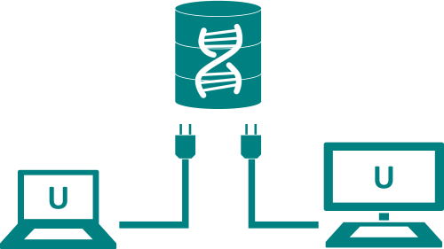

# Shared database
## [<<< ---](../micro.md)


## Проблема и контекст

Давайте предположим, что вы разрабатываете приложение интернет магазина на основе микросервисной архитектуры. Большинству  сервисов необходимо сохранять данные в базе данных. Например `Order service` хранит информацию о заказах и `Customer` сервис хранит информацию о клиентах.


- Разные сервисы предъявляют разные требования к хранению данных. Для некоторых сервисов реляционная база данных является лучшим выбором. Другим службам может потребоваться база данных NoSQL, такая как MongoDB, которая хороша для хранения сложных неструктурированных данных, или Neo4J, которая предназначена для эффективного хранения и запроса данных в формате графа.
- Некоторые запросы должны джоинить данные, принадлежащие нескольким сервисам. Например, для поиска клиентов в определенном регионе и их последних заказов требуется объединение клиентов и заказов.
- Сервисы должны быть слабо связаны, чтобы их можно было разрабатывать, развертывать и масштабировать независимо друг от друга.
- Некоторые бизнес транзакции должны применять транзакции, охватывающие данные нескольких сервисов Например, при размещении заказа, мы должны удостовериться, что новый заказ не превысит кредитный лимит клиента. Другие бизнес транзакции должны обновлять данные, принадлежащие нескольким сервисам.

## Решение

Используйте Shared базу данных для нескольких сервисов с похожим или одним и тем же бизнес доменом. При таком подходе каждый сервис будет иметь свободный доступ к данным, принадлежащим другим сервисам, с помощью локальных транзакций ACID.

## Пример реализации shared DB паттерна

`OrderService` и `CustomerService` имеют доступ к таблицам друг друга. Например, `OrderService` можно использовать следующую транзакцию ACID, чтобы гарантировать, что новый заказ не нарушит кредитный лимит клиента:

```sql
BEGINTRANSACTION
…
SELECT ORDER_TOTAL
FROM ORDERSWHERE CUSTOMER_ID = ?
…
SELECT CREDIT_LIMIT
FROM CUSTOMERSWHERE CUSTOMER_ID = ?
…
INSERTINTO ORDERS …
…
COMMITTRANSACTION
```

## Преимущества и недостатками использования Shared DB паттерна

### Преимущества:

- Разработчик использует знакомые и простые транзакции ACID для обеспечения согласованности данных.
- С единой базой данных проще работать

### Недостатки:

- **Development time coupling** — разработчик, работающий, например, над `OrderService`, должен согласовывать изменения схемы с разработчиками других сервисов, которые обращаются к тем же таблицам. Эта связь и дополнительная координация замедлят развитие.
- **Runtime coupling** — поскольку все сервисы обращаются к одной и той же базе данных, они потенциально могут мешать друг другу. Например, если длительная `CustomerService` транзакция удерживает блокировку `ORDER` таблицы, она `OrderService` будет заблокирована.
- Одна база данных может не удовлетворять требованиям к хранению данных и доступу ко всем сервисам.