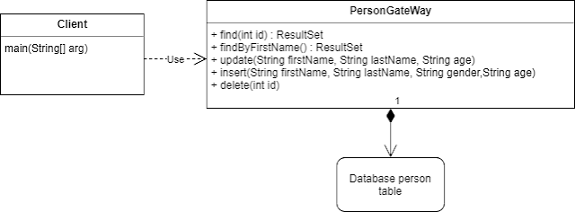

# Table Data Gateway (Шлюз к данным таблицы)

## [<<< ---](../sourcedata.md)

### Описание:

Объект выступает в качестве шлюза между данными в приложении и в БД. Один объект работает сразу со всеми записями в таблице.

Шлюз к данным таблицы содержит весь SQL для доступа к таблице или представлению (view): selects, inserts, updates, deletes. Идея состоит в том что Table Data Gateway предоставляет "прокси-класс" (шлюз) для доступа к каждой таблицы БД.

### Как это работает:

Шлюз табличных данных имеет простой интерфейс, обычно состоящий из нескольких методов поиска для получения данных из базы данных и методов обновления, вставки и удаления. Каждый метод отображает входные параметры в вызов SQL и выполняет SQL для соединения с базой данных. Шлюз табличных данных, как правило, не имеет состояния, поскольку его роль заключается в передаче данных с базы в бизнес логику и обратно.

По сути Table Data Gateway паттерн это прослойка которая отделяет SQL от бизнесс логики.

### Когда нужно использовать Table data gateway?

- Шлюз таблиц данных, вероятно, является наиболее простым в использовании интерфейс БД паттерном , поскольку он так хорошо отображается на таблицу базы данных или тип записи. Это также создает естественную точку для инкапсуляции точной логики доступа источника данных.
- Используя Table Data Gateway, у вас будет по одному шлюзудля каждой таблицы в базе данных. Однако для очень простых случаев у вас может быть один шлюз табличных данных, который обрабатывает все методы для всех таблиц.
- Одним из преимуществ использования шлюза табличных данных для инкапсуляции доступа к базе данных является то, что один и тот же интерфейс может работать как для использования SQL запросов для работы с БД, так и для использования хранимых процедур.