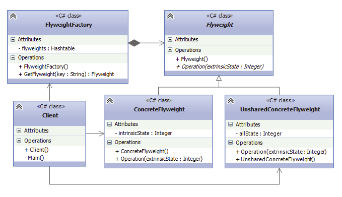

# Приспособленец (Flyweight)

## [<<< ---](../struct.md)

## Назначение:

**Паттерн Приспособленец (Flyweight)** - шаблон проектирования, который позволяет использовать разделяемые объекты сразу в нескольких контекстах. Данный паттерн используется преимущественно для оптимизации работы с памятью.

Приспособленец это экземпляр объекта, который выдает себя за группу самостоятельных экземпляров.

## Когда использовать Flyweight?

- в приложении используется большое число очень схожих экземпляров заданного класса;
- (и) часть состояния объекта является контекстной и может быть легко вынесена во внешние структуры;
- (и) после вынесения части состояния, все экземпляры становятся одинаковыми и это дает возможность заменить их одним;
- (и) приложение не проверяет идентичность объектов, т.к. в этом случае все якобы самостоятельные экземпляры являются одним объектом.

### Участники

- **Flyweight**: определяет интерфейс, через который приспособленцы-разделяемые объекты могут получать внешнее состояние или воздействовать на него
- **ConcreteFlyweight**: конкретный класс разделяемого приспособленца. Реализует интерфейс, объявленный в типе Flyweight, и при необходимости добавляет внутреннее состояние. Причем любое сохраняемое им состояние должно быть внутренним, не зависящим от контекста
- **UnsharedConcreteFlyweight**: еще одна конкретная реализация интерфейса, определенного в типе Flyweight, только теперь объекты этого класса являются неразделяемыми
- **FlyweightFactory**: фабрика приспособленцев - создает объекты разделяемых приспособленцев. Так как приспособленцы разделяются, то клиент не должен создавать их напрямую. Все созданные объекты хранятся в пуле. В примере выше для определения пула используется объект Hashtable, но это не обязательно. Можно применять и другие классы коллекций. Однако в зависимости от сложности структуры, хранящей разделяемые объекты, особенно если у нас большое количество приспособленцев, то может увеличиваться время на поиск нужного приспособленца - наверное это один из немногих недостатков данного паттерна.
    
    Если запрошенного приспособленца не оказалось в пуле, то фабрика создает его.
    
- **Client**: использует объекты приспособленцев. Может хранить внешнее состояние и передавать его в качестве аргументов в методы приспособленцев.