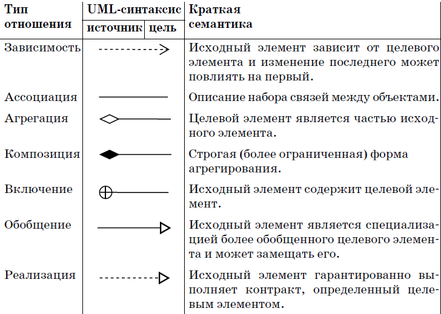

# uml

## [<<< ---](../gomod.md)

[About Mermaid | Mermaid](https://mermaid.js.org/intro/)




```go
package composite

import (
	"fmt"
	"strconv"
	"testing"
)

type File struct {
	name string
	size int
}

func NewFile(name string, size int) *File {
	return &File{name: name, size: size}
}

func (f *File) GetName() string {
	return f.name
}

func (f *File) GetSize() int {
	return f.size
}

// Print this element with the "upperPath".
func (f *File) Print(upperPath string) {
	fmt.Println(upperPath + "/" + f.String())
}

func (f *File) String() string {
	return f.GetName() + " (" + strconv.Itoa(f.GetSize()) + ")"
}

//--- Directory

type Directory struct {
	name string
	elements []FileSystemElement
}

func NewDirectory(name string) *Directory {
	return &Directory{name: name, elements: []FileSystemElement{}}
}

func (d *Directory) GetName() string {
	return d.name
}

func (d *Directory) GetSize() int {
	var size int = 0
	for _, element := range d.elements {
		size += element.GetSize()
	}
	return size
}

// Print this element with the "upperPath".
func (d *Directory) Print(upperPath string) {
	fmt.Println(upperPath + "/" + d.String())
	for _, element := range d.elements {
		element.Print(upperPath + "/" + d.name)
	}
}

func (d *Directory) String() string {
	return d.GetName() + " (" + strconv.Itoa(d.GetSize()) + ")"
}

// Add an element
func (d *Directory) Add(element FileSystemElement) {
	d.elements = append(d.elements, element)
}

//--- File system element
type FileSystemElement interface {
	GetName() string
	GetSize() int
	// Print this element with the "upperPath".
	Print(upperPath string)
	String() string
}

//--- Testing

/*
Represents a file system composed of files and directories. FileSystemElement makes
it possible to treat File and Directory uniformly.
*/

func TestMain(m *testing.M) {
	fmt.Println("Create a file system...")

	binDir := NewDirectory("bin")
	lsFile := NewFile("ls", 20)
	binDir.Add(lsFile)
	mkdirFile := NewFile("mkdir", 40)
	binDir.Add(mkdirFile)

	emilyDir := NewDirectory("emily")
	homeworkFile := NewFile("homework.doc", 60)
	emilyDir.Add(homeworkFile)

	jamesDir := NewDirectory("james")
	appFile := NewFile("app.exe", 80)
	jamesDir.Add(appFile)

	homeDir := NewDirectory("home")
	homeDir.Add(emilyDir)
	homeDir.Add(jamesDir)

	rootDir := NewDirectory("root")
	rootDir.Add(homeDir)
	rootDir.Add(binDir)

	rootDir.Print("")
}
```