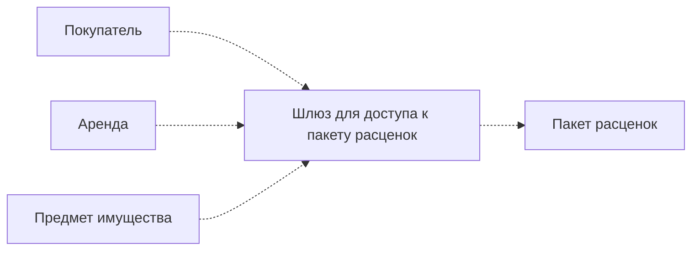

# Шлюз (Gateway)

## [<<< ---](../../index.md)



Шлюз — объект, инкапсулирующий доступ к внешней системе или источнику данных

### Назначение

Шлюз рекомендуется применять во всех случаях, когда интерфейс доступа к внешнему источнику слишком неудобен. Наличие шлюза позволяет сконцентрировать все неудобные обращения в одном месте вместо того, чтобы распространять их по всей системе. Применение шлюза не несет побочных эффектов, а код приложения становится более читабельным и понятным.

Как уже отмечалось, шлюз значительно облегчает тестирование, поскольку представляет собой потенциальную точку внедрения фиктивных служб. Даже если с интерфейсом внешней системы все в порядке, использование шлюза позволяет сделать первый шаг в направлении реализациификтивной службы.

Не менее важным преимуществом шлюза является возможность легко переключаться между источниками данных. Дня перехода к другому источнику достаточно просто изменить класс шлюза — оставшейся части системы это не коснется. Таким образом, шлюз представляет собой простое и мощное средство инкапсуляции изменений. Иногда потребность в наличии подобной степени гибкости, а следовательно, и в реализации шлюза кажется спорной. Тем не менее, даже если вы не собираетесь менять источник данных в обозримом будущем, вы несомненно выиграете от простоты написания и тестирования кода, которую обеспечивает данное типовое решение.

В качестве альтернативного варианта изолирования приложений от внешних источников может применяться паттерн [**Mapper**](mapper.md). Однако маппер имеет более сложную структуру, нежели шлюз.

### Пример реализации на Go (Gateway)

```go
package main

import "context"

// Внешняя система (например, HTTP-сервис) скрыта за контрактом.
type ExternalAPI interface {
	FetchUser(ctx context.Context, id int64) (string, error)
}

// Реальная реализация.
type RealAPI struct{}

func (api RealAPI) FetchUser(ctx context.Context, id int64) (string, error) {
	return "real-user-" + itoa(id), nil
}

// Gateway инкапсулирует работу с внешней системой и может менять механику (retry, auth, протокол и т.д.).
type UserGateway struct {
	api ExternalAPI
}

func (g UserGateway) UserName(ctx context.Context, id int64) (string, error) {
	return g.api.FetchUser(ctx, id)
}

// Для примера stub можно оставить очень простым.
type StubAPI struct{}

func (api StubAPI) FetchUser(ctx context.Context, id int64) (string, error) {
	return "stub-user-" + itoa(id), nil
}

func itoa(v int64) string {
	// минимально, чтобы пример был самодостаточным
	if v == 0 {
		return "0"
	}
	sign := ""
	if v < 0 {
		sign = "-"
		v = -v
	}
	buf := make([]byte, 0, 20)
	for v > 0 {
		buf = append(buf, byte('0'+(v%10)))
		v /= 10
	}
	// разворачиваем
	for i, j := 0, len(buf)-1; i < j; i, j = i+1, j-1 {
		buf[i], buf[j] = buf[j], buf[i]
	}
	return sign + string(buf)
}

func main() {
	ctx := context.Background()

	// В проде:
	gwProd := UserGateway{api: RealAPI{}}
	_ = gwProd

	// В тесте:
	gwTest := UserGateway{api: StubAPI{}}
	name, _ := gwTest.UserName(ctx, 42)
	_ = name
}
```
