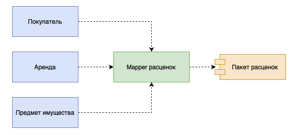

# Mapper

## [<<< ---](../../index.md)



Mapper — объект, устанавливающий взаимодействие между двумя независимыми объектами.

Основное назначение преобразователя состоит в отделении друг от друга различных частей программной системы. Похожие функции выполняет и шлюз который мы описали выше. Шлюз применяется гораздо чаще, чем маппер, поскольку он намного проще и в написании, и в последующем использовании.

Таким образом, маппер необходимо использовать только тогда, когда ни одна из отображаемых систем не должна зависеть от взаимодействия с другой системой. Это действительно важно только в том случае, когда структура взаимодействия особенно сложна и практически не связана с основным назначением каждой системы. Поэтому в корпоративных приложениях главной областью применения маппера является обслуживание взаимодействий с базой данных который выражается отдельным паттерном [**Data Mapper**](../sourcedata/datamapper.md).

### Пример реализации на Go (Mapper)

```go
package main

// Domain: доменная модель (не зависит от БД/DTO).
type User struct {
	ID   int64
	Name string
}

// Data/DTO: структура, которую возвращает внешний слой (например, БД).
type UserRow struct {
	UserID int64
	Full   string
}

// Mapper преобразует UserRow -> User и обратно, изолируя слои.
type UserMapper struct{}

func (m UserMapper) ToDomain(r UserRow) User {
	return User{ID: r.UserID, Name: r.Full}
}

func (m UserMapper) ToRow(u User) UserRow {
	return UserRow{UserID: u.ID, Full: u.Name}
}

func main() {
	var mapper UserMapper

	row := UserRow{UserID: 1, Full: "Alice"}
	domain := mapper.ToDomain(row)

	_ = mapper.ToRow(domain)
	_ = domain
}
```