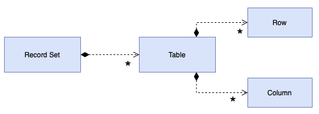

# Record Set

## [<<< ---](../../index.md)



За последние двадцать лет основным способом представления данных в БД стали реляционные таблицы. Почти каждый новый разработчик использует реляционные данные.

За это время появилось множество UI инструментов. Эти UI-фреймворки основываются на реляционности данных и предоставляют различные UI-элементы, которые легко настраиваются и управляются практически безо всякого программирования.

Обратная сторона медали в том, что, несмотря на невероятную лёгкость вывода и работы с данными, эти элементы не предусматривают возможности добавления кода бизнес-логики. Проверки типа "правильный ли формат у эта даты" и любые правила исполнения попросту некуда поставить. И в итоге, эта логика либо забивается в БД, либо смешивается в кодом вывода информации.

Суть Record Set в предоставлении структуры данных, которая выглядит в точности как результат SQL-запроса, но может управляться и обрабатываться любыми частями системы.

### Пример реализации на Go (Record Set)

```go
package main

import "fmt"

// Row — строка “как в SQL”.
type Row map[string]any

// RecordSet — набор строк, который можно передавать по системе.
type RecordSet struct {
	rows []Row
}

func NewRecordSet(rows []Row) RecordSet {
	return RecordSet{rows: rows}
}

// Iter — простой итератор по строкам.
func (rs RecordSet) Iter() <-chan Row {
	out := make(chan Row)
	go func() {
		defer close(out)
		for _, r := range rs.rows {
			out <- r
		}
	}()
	return out
}

func main() {
	rs := NewRecordSet([]Row{
		{"id": 1, "name": "Alice"},
		{"id": 2, "name": "Bob"},
	})

	for row := range rs.Iter() {
		fmt.Println("row:", row["id"], row["name"])
	}
}
```