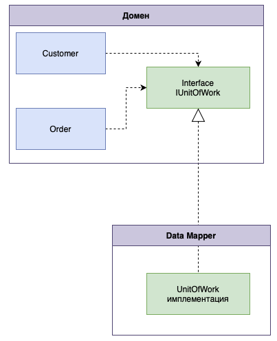

# Отделенный интерфейс (Separated Interface)

## [<<< ---](../../index.md)



Separated Interface предполагает размещение интерфейса и его реализации в разных пакетах.

При разработке какой-либо системы, можно добиться улучшение её архитектуры, уменьшая связанность между её частями. Это можно сделать так - распределив классы по отдельным пакетам и контролировать зависимости этими пакетами. Тогда можно следовать правилам о том, как классы из одного пакета могут обращаться к классам из другого пакета. Например, то, которое запрещает классам с уровня данных обращаться к классам с уровня представления.

### Назначение

Отделенный интерфейс применяется для того, чтобы избежать возникновения зависимостей между двумя частями системы. Наиболее часто подобная необходимость возникает в описанных ниже ситуациях.

- Если вы разместили в пакете инфраструктуры абстрактный код для обработки стандартных случаев, который должен вызывать конкретный код приложения.
- Если код одного слоя приложения должен обратиться к коду другого слоя, о суще ствовании которого он не знает (например, когда код домена обращается к Data Mapper.
- Если нужно вызвать методы, разработанные кем-то другим, но вы не хотите, что бы ваш код зависел от интерфейсов API этих разработчиков.

### Пример реализации на Go (Separated Interface)

В Go разделение обычно реализуют через интерфейсы в одном пакете и реализации в других пакетах (ниже пример “в одном файле” для наглядности).

```go
package main

import "context"

// package domain:
// Интерфейс объявлен в домене, а реализации могут быть в инфраструктуре.
type UserRepository interface {
	FindByID(ctx context.Context, id int64) (User, error)
}

type User struct {
	ID   int64
	Name string
}

// package infrastructure (реализация в другом пакете):
type InMemoryRepo struct {
	data map[int64]User
}

func (r InMemoryRepo) FindByID(ctx context.Context, id int64) (User, error) {
	u, ok := r.data[id]
	if !ok {
		return User{}, context.Canceled // просто для примера
	}
	return u, nil
}

// domain service:
type UserService struct {
	repo UserRepository
}

func (s UserService) GetUserName(ctx context.Context, id int64) (string, error) {
	u, err := s.repo.FindByID(ctx, id)
	if err != nil {
		return "", err
	}
	return u.Name, nil
}

func main() {
	ctx := context.Background()

	svc := UserService{
		repo: InMemoryRepo{data: map[int64]User{1: {ID: 1, Name: "Alice"}}},
	}
	_, _ = svc.GetUserName(ctx, 1)
}
```