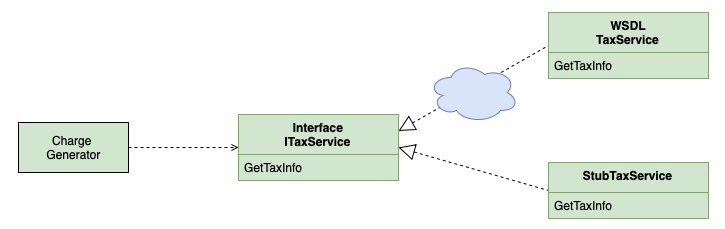

# Фиктивная служба (Service Stub)

## [<<< ---](../../index.md)



Service stub — устраняет зависимость приложения от труднодоступных или проблемных служб на время тестирования.

### Назначение

Фиктивная служба используется тогда, когда зависимость приложения от конкретной внешней службы значительно затрудняет процесс разработки и тестирования. Следует отметить, что многие приверженцы экстремального программирования употребляют термин объект-имитатор (mock object), имея в виду не что иное, как фиктивную службу. По сути каждый раз когда вам нужно имитировать работу какой-то внешней службы, можно с помощью интерфейса и DI подставить реализация stub сервиса при тестировании.

### Пример реализации на Go (stub вместо внешнего сервиса)

Идея: бизнес-логика зависит не от конкретного сервиса, а от интерфейса. В проде подставляется `RealService`, в тестах — `ServiceStub`.

```go
package main

import (
	"context"
	"fmt"
)

// Service — внешний сервис (например, payment provider, user service, и т.п.)
type Service interface {
	GetUser(ctx context.Context, id int64) (User, error)
}

type User struct {
	ID   int64
	Name string
}

// RealService — реальная реализация, которая обычно ходит в сеть/БД.
type RealService struct{}

func (s RealService) GetUser(ctx context.Context, id int64) (User, error) {
	// имитация “боевого” вызова
	return User{ID: id, Name: "real-user"}, nil
}

// ServiceStub — заглушка для тестов/локальной разработки.
type ServiceStub struct {
	Users map[int64]User
	Err   error
}

func (s ServiceStub) GetUser(ctx context.Context, id int64) (User, error) {
	if s.Err != nil {
		return User{}, s.Err
	}
	u, ok := s.Users[id]
	if !ok {
		return User{}, fmt.Errorf("stub: user %d not found", id)
	}
	return u, nil
}

// Business-логика не знает, real это или stub.
type UserUseCase struct {
	svc Service
}

func (uc UserUseCase) FindUserName(ctx context.Context, id int64) (string, error) {
	u, err := uc.svc.GetUser(ctx, id)
	if err != nil {
		return "", err
	}
	return u.Name, nil
}

func main() {
	ctx := context.Background()

	// В проде:
	ucProd := UserUseCase{svc: RealService{}}
	nameProd, _ := ucProd.FindUserName(ctx, 1)
	fmt.Println("prod:", nameProd)

	// В тесте/локально:
	stub := ServiceStub{
		Users: map[int64]User{
			1: {ID: 1, Name: "stub-user"},
		},
	}
	ucTest := UserUseCase{svc: stub}
	nameTest, _ := ucTest.FindUserName(ctx, 1)
	fmt.Println("test:", nameTest)
}
```