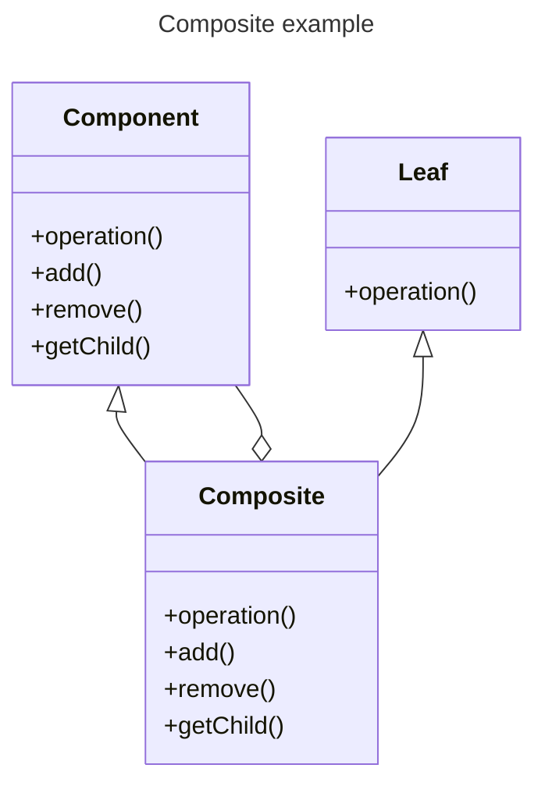

# Composite

## [<<< ---](../../index.md)



## Назначение:

Компонует объекты в древовидные структуры для представления иерархий «часть — целое». Позволяет клиентам единообразно трактовать индивидуальные и составные объекты.

Реализацию паттерна можно представить в виде меню, которое имеет различные пункты. Эти пункты могут содержать подменю, в которых, в свою очередь, также имеются пункты. То есть пункт меню служит с одной стороны частью меню, а с другой стороны еще одним меню. В итоге мы однообразно можем работать как с пунктом меню, так и со всем меню в целом.

## Когда использовать Composite?

- Когда объекты должны быть реализованы в виде иерархической древовидной структуры
- Когда клиенты единообразно должны управлять как целыми объектами, так и их составными частями. То есть целое и его части должны реализовать один и тот же интерфейс

## Применимость

Компоновщик — это относительно низкоуровневый паттерн проектирования, который лежит в основе других паттернов. Команды объединяются в составные команды, декоратор является составным объектом с одним дочерним элементом, посетитель очень часто обходит составные объекты иерархической формы.

### Пример реализации на Go (Composite: меню/дерево)

```go
package main

import "fmt"

type Component interface {
	Operation() string
	Add(c Component)
	Remove(c Component)
	Children() []Component
}

// Leaf — лист дерева, не содержит детей.
type Leaf struct {
	name string
}

func (l *Leaf) Operation() string         { return "leaf:" + l.name }
func (l *Leaf) Add(c Component)          {}
func (l *Leaf) Remove(c Component)       {}
func (l *Leaf) Children() []Component   { return nil }

// Composite — составной узел, который хранит детей.
type Composite struct {
	name     string
	children []Component
}

func (c *Composite) Operation() string {
	out := "composite:" + c.name
	for _, ch := range c.children {
		out += " -> " + ch.Operation()
	}
	return out
}

func (c *Composite) Add(child Component)        { c.children = append(c.children, child) }
func (c *Composite) Remove(child Component)     { /* для примера опущено */ }
func (c *Composite) Children() []Component     { return c.children }

func main() {
	root := &Composite{name: "root"}
	root.Add(&Leaf{name: "A"})
	root.Add(&Leaf{name: "B"})

	fmt.Println(root.Operation())
}
```