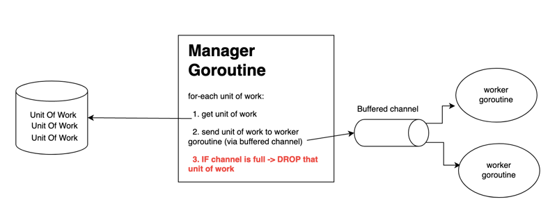

# Drop

## [<<< ---](../index.md)

Основная идея паттерна **Drop** — ограничить объём работы, который может выполняться в любой момент времени.



У нас есть:

- буферизованный канал, выступающий в роли счётчика/очереди;
- некоторое количество worker‑горутины;
- manager‑горутина, которая:
    - принимает работу и отправляет её worker‑горутинам;
    - если работы больше, чем могут обработать worker‑ы, и буфер канала полон, manager **отбрасывает** (drop) новую единицу работы.

### Пример

В **Drop** мы имеем ограниченный объём работы (`capacity`), который можно сделать «за день».

Есть заданное количество `employees`, которые выполняют работу (`worker`‑горутины).

Есть `manager` (`main`‑горутина), который генерирует задачи (или берёт их из заранее определённого списка).

`Manager` уведомляет сотрудников о работе через канал `ch`, а `Employee` забирают задачи из канала `ch`.

Канал `ch` способен удерживать ограниченное количество задач в очереди (`buffered channel`). Говорят, что канал имеет ограниченную `capacity`. Как только буфер `ch` заполнен, `manager` не может отправить новую задачу и вместо этого решает **DROP** — отбросить эту единицу работы и попробовать отправить следующую (вдруг к этому моменту в `ch` освободится место). Менеджер продолжает так поступать, пока есть входящая работа.

### Use Case

Хороший пример применения — DNS‑сервер. У него есть ограниченная пропускная способность: максимум запросов, которые он может обработать одновременно. Если запросов приходит больше, мы либо «положим» сервер, перегрузив его, либо будем **отбрасывать** новые запросы до тех пор, пока у DNS‑сервера снова не появится возможность их обрабатывать.

Пример можно запустить на [Go Playground](https://play.golang.org/p/vTnynyXgs_l)

```go
package main

import (
    "fmt"
    "time"
)

func main() {
    // capacity —
    // максимальное количество активных запросов в любой момент времени
    const cap = 100

    // буферизованный канал позволяет определить момент, когда мы достигли лимита
    ch := make(chan string, cap)

    // worker‑горутина, «сотрудник»
    go func() {
        // for‑range по каналу `ch` — проверяем, появилась ли новая работа
        for p := range ch {
            fmt.Println("employee : received signal :", p)
        }
    }()

    // объём работы
    const work = 200

    // обходим набор единиц работы, по одной за раз
    for w := 0; w < work; w++ {
        // select позволяет выполнять несколько операций с каналами
        // одновременно в одной горутине
        select {

        // пытаемся отправить работу в канал:
        // менеджер посылает задачу сотруднику через буферизованный канал;
        // если буфер полон, срабатывает ветка default.
        case ch <- "paper":
            fmt.Println("manager : sent signal :", w)

        // если буфер канала заполнен — «роняем» сообщение:
        // так мы понимаем, что достигли предела;
        // менеджер отбрасывает единицу работы.
        default:
            fmt.Println("manager : dropper data :", w)
        }
    }

    // после отправки последней единицы работы закрываем канал;
    // worker‑горутины дообработают всё, что осталось в буфере.
    close(ch)
    fmt.Println("manager : sent shutdown signal")

    time.Sleep(time.Second)
}

```

### Результат

```
go run main.go

manager : sent signal : 0
manager : sent signal : 1
manager : sent signal : 2
manager : sent signal : 3
manager : sent signal : 4
...
manager : dropper data : 101
manager : dropper data : 102
...
employee : received signal : paper
employee : received signal : paper
...
employee 0 : received shutdown signal
...
employee : received signal : paper
employee : received signal : paper`
```